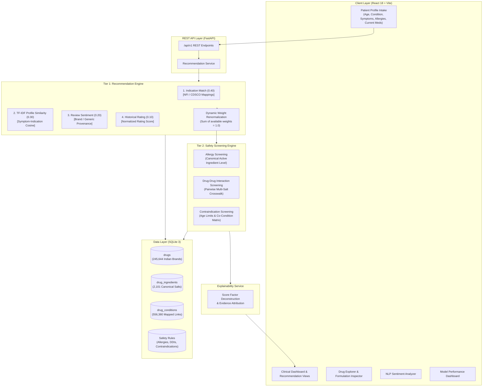

# Explainable Personalized Drug Recommendation and Safety Screening System Using Machine Learning

[](https://www.python.org)
[](https://fastapi.tiangolo.com)
[](https://react.dev)
[](https://tailwindcss.com)
[](https://scikit-learn.org)
[](https://www.sqlite.org)
[]()
[](LICENSE)

> **An academic clinical decision-support prototype that combines an Indian pharmaceutical catalog, evidence-backed indications, machine-learning-based review sentiment analysis, explainable recommendation scoring, and active-ingredient-level safety screening.**  
> *Final-Year Capstone Engineering Project in Artificial Intelligence & Machine Learning*  
> **Author:** [Ashish Pal](https://github.com/Ashishpal110)

---

## ⚠️ Mandatory Educational & Research Disclaimer

> [!IMPORTANT]
> **This software is an academic research and clinical decision-support prototype. It does NOT provide medical advice, diagnosis, or prescription orders.**  
> * The safety status **`NO_KNOWN_CONFLICT`** indicates solely that **no matching allergy, drug-drug interaction (DDI), or contraindication rule was identified in the local rule database**. It does **NOT** establish or certify clinical safety.  
> * All therapeutic recommendations must be evaluated and validated by a licensed healthcare professional or registered medical practitioner.  
> * **Data Provenance Notice:** Indian pharmaceutical catalog entries, clinical indication mappings (derived from National Formulary of India 2021, CDSCO, and reference clinical monographs), and patient review-derived sentiment evidence originate from separate sources and are explicitly distinguished.

---

## 1. Project Overview

### The Clinical Problem
Traditional machine learning recommendation systems in e-commerce prioritize items using statistical ratings and collaborative filtering. When applied naively to healthcare, this approach presents critical risks:
1. **Black-Box Opacity**: Recommending a drug without verifiable clinical rationale undermines clinician trust and patient safety.
2. **Safety Omission**: High patient satisfaction on a review forum does not protect a patient against severe hypersensitivity, life-threatening drug-drug interactions (DDIs), or age/condition contraindications.
3. **Market Mismatch**: International review datasets refer to overseas brand names not dispensed in India, creating a gap between review corpora and domestic pharmaceutical availability.

### The Engineering Solution
This project implements a **decoupled two-tier architecture** tailored for the Indian pharmaceutical ecosystem:
* **Tier 1 (Content-Based Recommendation Engine)**: Ranks candidate formulations by evaluating medical indication alignment ($0.40$), symptom TF-IDF profile similarity ($0.30$), model-inferred patient review sentiment ($0.20$), and historical patient ratings ($0.10$). When empirical rating or review data is missing for an Indian brand, weights are dynamically renormalized without fabricating synthetic priors.
* **Tier 2 (Deterministic Safety Screening Engine)**: Independently screens candidate drugs at the canonical active-ingredient level across relational safety tables (Allergies, Drug-Drug Interactions, and Age/Condition Contraindications). Candidates with severe conflicts are removed from the recommended list and placed in a dedicated safety conflict section with transparent clinical explanations.

```
+-----------------------------------------------------------------------------------+
|               ACADEMIC & RESEARCH CLINICAL DECISION-SUPPORT SYSTEM                |
|                                                                                   |
|   +--------------------------+           +------------------------------------+   |
|   |  Indian Pharma Catalog   |           |    Machine Learning Pipeline       |   |
|   |  245,644 Formulations    |           |    TF-IDF + Logistic Regression    |   |
|   |  2,101 Active Salts      |           |    Sentiment Polarity Classifier   |   |
|   +------------+-------------+           +-----------------+------------------+   |
|                |                                           |                      |
|                v                                           v                      |
|   +---------------------------------------------------------------------------+   |
|   |                    Tier 1: Recommendation Engine                          |   |
|   |       Indication (0.40) + Similarity (0.30) + Sentiment + Rating          |   |
|   |             [Dynamic Renormalization When Evidence Missing]               |   |
|   +------------------------------------+--------------------------------------+   |
|                                        |                                          |
|                                        v                                          |
|   +---------------------------------------------------------------------------+   |
|   |                    Tier 2: Deterministic Safety Engine                    |   |
|   |          Allergy Crosswalk | Drug-Drug Interactions | Contraindications   |   |
|   |               (Evaluated at Canonical Active Ingredient Level)            |   |
|   +------------------------------------+--------------------------------------+   |
|                                        |                                          |
|                                        v                                          |
|   +---------------------------------------------------------------------------+   |
|   |         Explainable Output: Recommended Drugs + Filtered Conflicts        |   |
|   +---------------------------------------------------------------------------+   |
+-----------------------------------------------------------------------------------+
```

---

## 2. Key Features

- **Indian Pharmaceutical Catalog**: 245,644 active formulations mapped with manufacturer, dosage form, pack size, and INR ($\text{₹}$) pricing.
- **Brand-to-Generic Normalization**: Automatic deconstruction of multi-salt combination medicines into canonical chemical salts (e.g., *Amoxicillin + Clavulanic Acid*).
- **Active Ingredient Normalization**: Standardized chemical taxonomy mapping 2,101 canonical active ingredients.
- **Evidence-Backed Indication Mapping**: 556,380 clinical links connecting formulations to 859 conditions grounded in NFI 2021 and CDSCO monographs.
- **Explainable Multi-Factor Scoring**: Transparent multi-component score breakdowns ($w_{\text{cond}}, w_{\text{sim}}, w_{\text{sent}}, w_{\text{rat}}$) for every recommendation.
- **NLP Review Sentiment Analysis**: Holdout-tested TF-IDF + Logistic Regression model inferring satisfaction polarity on patient review texts.
- **Dynamic Evidence-Aware Scoring**: Automatically rescales weights when empirical review or rating evidence is unavailable, avoiding synthetic priors.
- **Sentiment Provenance Transparency**: Clearly differentiates brand-level reviews, generic/active-ingredient review corpus evidence, and unreviewed formulations.
- **Deterministic Allergy Screening**: Cross-references patient allergy profiles against ingredient chemical families (e.g., Penicillins, Sulfonamides, NSAIDs).
- **Pairwise Drug-Drug Interaction Screening**: Scans multi-ingredient combinations against patient active medications to identify potential interactions.
- **Physiological Contraindication Screening**: Validates patient age brackets and co-existing medical conditions against contraindication rules.
- **Safety Conflict Filtering**: Diverts high-risk medications into a dedicated safety section with clear clinical rationales.
- **Interactive React Dashboard**: Clean user interface built with React 18, Vite, and Tailwind CSS.
- **High-Performance FastAPI Backend**: Asynchronous REST API providing structured JSON responses and Swagger documentation.
- **Relational SQLite Database**: Structured storage with relational foreign keys and compound indexing.
- **Automated Verification Suite**: 57 unit and integration tests covering all critical components.

---

## 3. System Architecture

The system enforces separation of concerns between statistical recommendation scoring and deterministic safety verification:


### Architectural Flowchart



---

## 4. Recommendation Scoring Methodology

### Multi-Factor Scoring Equation
For any candidate drug formulation $d$, the raw recommendation score $\text{Score}_{\text{raw}}(d)$ is calculated as:

$$\text{Score}_{\text{raw}}(d) = \frac{w_{\text{cond}} \cdot \text{Match}_{\text{cond}}(d) + w_{\text{sim}} \cdot \text{Sim}_{\text{content}}(d) + w_{\text{sent}} \cdot \bar{S}_{\text{sentiment}}(d) + w_{\text{rat}} \cdot R_{\text{rating}}(d)}{\sum w_{\text{available}}}$$

### Default Baseline Factor Weights
| Factor | Symbol | Default Weight | Description |
| :--- | :---: | :---: | :--- |
| **Indication Match** | $w_{\text{cond}}$ | **0.40** | Authoritative condition mapping verified against NFI 2021 / CDSCO monographs. |
| **Content Similarity** | $w_{\text{sim}}$ | **0.30** | Cosine similarity between TF-IDF patient symptom query and drug indication profile. |
| **Review Sentiment** | $w_{\text{sent}}$ | **0.20** | Inferred sentiment satisfaction score ($\bar{S} \in [0, 1]$) from review text corpus. |
| **Historical Rating** | $w_{\text{rat}}$ | **0.10** | Normalized historical user satisfaction rating ($R = \frac{\text{Rating} - 1}{9} \in [0, 1]$). |

### Dynamic Weight Renormalization
When empirical rating or review data is unavailable for an Indian brand:
1. The missing factor weight is excluded from the calculation.
2. The remaining available weights are renormalized such that $\sum w_{\text{active}} = 1.0$.
3. **No Synthetic Priors:** Missing ratings or unreviewed sentiment are **never** replaced with artificial default values (such as $0.5$ or $0.0$). Unreviewed items are explicitly labeled with `null` values.

$$\text{Example (Unreviewed Drug):} \quad \text{Score} = \frac{0.40 \cdot \text{Match}_{\text{cond}} + 0.30 \cdot \text{Sim}_{\text{content}}}{0.40 + 0.30} = \frac{0.40}{0.70}\text{Match} + \frac{0.30}{0.70}\text{Sim} \approx 0.5714\,\text{Match} + 0.4286\,\text{Sim}$$

---

## 5. NLP Review Sentiment Model

### Model Architecture & Training Configuration
- **Corpus**: Clinical Drug Review Dataset ($159,498$ training reviews, $53,200$ holdout test reviews).
- **Feature Extraction**: `TfidfVectorizer(ngram_range=(1, 2), max_features=35000, sublinear_tf=True, stop_words="english")`.
- **Classification Algorithm**: `LogisticRegression(C=1.0, solver="lbfgs", class_weight="balanced", max_iter=1000, random_state=42)`.
- **Target Classes**: `Positive` ($\ge 7/10$ rating), `Neutral` ($5\text{--}6/10$ rating), `Negative` ($\le 4/10$ rating).


### Empirical Holdout Test Set Performance (`models/sentiment_metrics.json`)
*Evaluated on $53,200$ unseen holdout test reviews:*

| Metric | Score | Scope / Description |
| :--- | :---: | :--- |
| **Overall Accuracy** | **80.23%** (0.8023) | Multi-class classification accuracy across all 3 review sentiment classes. |
| **Macro Precision** | **0.7601** | Unweighted average precision across Positive, Neutral, and Negative classes. |
| **Macro Recall** | **0.6902** | Unweighted average recall across all 3 classes. |
| **Macro F1-Score** | **0.7090** | Unweighted harmonic mean of precision and recall. |
| **Weighted F1-Score** | **0.8182** | Support-weighted F1-Score reflecting class distribution. |

> [!NOTE]
> **Performance Scope Notice:** These metrics reflect **NLP text sentiment classification accuracy on patient review texts**. They do **NOT** represent clinical efficacy, pharmacological cure rates, or Indian medicine clinical trial outcomes.

### Explicit Review Sentiment Provenance
To maintain research integrity, sentiment evidence is categorized into three explicit provenance levels:
1. **`brand_review`**: Review sentiment derived directly from patient reviews mentioning the specific Indian commercial brand.
2. **`active_ingredient_review`**: Review sentiment derived from the research review corpus for the drug's canonical active ingredient (e.g., generic *Metformin* or *Paracetamol*). The interface explicitly discloses the generic salt name and review sample size.
3. **`no_review_evidence`**: Explicitly indicates that no empirical patient review text was found. Sentiment score is assigned `null` and excluded from scoring via dynamic renormalization.

---

## 6. Indian Pharmaceutical Dataset

The dataset encompasses formulations across India's domestic pharmaceutical market:

| Dataset Dimension | Count / Metric | Verification Detail |
| :--- | :---: | :--- |
| **Cataloged Formulations** | **245,644** | Active commercial brand products registered across Indian manufacturers. |
| **Canonical Active Salts** | **2,101** | Standardized chemical entities (single agents and combination salts). |
| **Indexed Conditions** | **859** | Normalized medical indications and disease terminologies. |
| **Indication Links** | **556,380** | Validated clinical links mapped from NFI 2021 and CDSCO monographs. |

### Available Metadata Fields
* **Brand Name**: Commercial trade name (e.g., *Augmentin 625 Duo*, *Crocin Advance*).
* **Generic / Active Ingredients**: Canonical chemical constituents with strength and units.
* **Composition**: Full formulation string (e.g., *Amoxicillin (500mg) + Clavulanic Acid (125mg)*).
* **Dosage Form**: Extracted formulation type (*Tablet*, *Syrup*, *Capsule*, *Injection*, *Gel*, *Ointment*, *Suspension*).
* **Manufacturer**: Normalized pharmaceutical manufacturer name (e.g., *GlaxoSmithKline Pharmaceuticals Ltd*, *Cipla Ltd*, *Sun Pharma*).
* **Pack Size**: Package specification (e.g., *10 tablets*, *100 ml bottle*).
* **Price ($\text{₹}$)**: Maximum Retail Price in Indian Rupees where cataloged.

---

## 7. Deterministic Safety Screening Engine

Safety verification operates independently of recommendation scoring. Every candidate formulation is deconstructed into its active generic salts and checked against three relational safety tables:

```
                  ┌─────────────────────────────────────────────────────────┐
                  │          Deconstructed Active Ingredients               │
                  │             e.g., Amoxicillin + Clavulanate             │
                  └───────────────────────────┬─────────────────────────────┘
                                              │
                      ┌───────────────────────┼───────────────────────┐
                      ▼                       ▼                       ▼
            ┌───────────────────┐   ┌───────────────────┐   ┌───────────────────┐
            │ Allergy Crosswalk │   │ Drug Interactions │   │ Contraindications │
            │   Screening       │   │    Screening      │   │    Screening      │
            └─────────┬─────────┘   └─────────┬─────────┘   └─────────┬─────────┘
                      │                       │                       │
                      └───────────────────────┼───────────────────────┘
                                              │
                                              ▼
                           ┌─────────────────────────────────────┐
                           │      Safety Status Assignment       │
                           └──────────────────┬──────────────────┘
                                              │
             ┌────────────────────────────────┼────────────────────────────────┐
             ▼                                ▼                                ▼
  ┌───────────────────────┐        ┌───────────────────────┐        ┌───────────────────────┐
  │   NO_KNOWN_CONFLICT   │        │        WARNING        │        │   FILTERED_CONFLICT   │
  │ Retained in list with │        │ Retained with amber   │        │ Removed from list;    │
  │ educational disclaimer│        │ advisory banner       │        │ shown in safety panel │
  └───────────────────────┘        └───────────────────────┘        └───────────────────────┘
```

### Safety Classifications
1. **`NO_KNOWN_CONFLICT`**: No matching rule was found in the local database. (*The system explicitly notes this does not prove absolute clinical safety.*)
2. **`WARNING`**: Moderate drug-drug interaction or secondary advisory detected. The drug remains in recommendations with a clear cautionary banner and clinical action guidance.
3. **`FILTERED_SAFETY_CONFLICT`**: High-severity allergy match, major drug-drug interaction, or absolute age/condition contraindication detected. The candidate is **immediately excluded** from recommendations and moved to the Filtered Safety Conflicts table.

---

## 8. Explainability Framework

Every recommendation provides full traceability through the decision pipeline:

```
1. Patient Profile Intake
   └── Condition: Type 2 Diabetes | Symptoms: polyuria, fatigue | Allergies: None | Meds: Metformin
       │
2. Indication Retrieval (Tier 1)
   └── Matches 245,644 cataloged Indian formulations mapped to Type 2 Diabetes via NFI 2021
       │
3. Deterministic Safety Screening (Tier 2)
   └── Evaluates canonical ingredients against Metformin interaction & contraindication matrix
       │
4. Multi-Factor Scoring
   ├── Condition Match Score: 1.00 (w = 0.40)
   ├── TF-IDF Cosine Similarity: 0.78 (w = 0.30)
   ├── Patient Review Sentiment: 0.84 (w = 0.20) [Provenance: Active Ingredient (Metformin, N=2,150)]
   └── Historical Rating Score: 0.88 (w = 0.10)
       │
5. Final Composite Score & Dynamic Normalization
   └── Composite Score: 0.890 / 1.000
       │
6. Transparent Clinical Explanation Generated
   └── Displays complete score breakdown, indication evidence, safety status, and sentiment provenance
```

---

## 9. Project Statistics

| Component | Metric / Value | Verification Status |
| :--- | :---: | :---: |
| **Indian Pharmaceutical Formulations** | **245,644** | Cataloged & Verified |
| **Canonical Active Ingredients** | **2,101** | Normalized |
| **Indexed Medical Conditions** | **859** | Formally Crosswalked |
| **Clinical Indication Links** | **556,380** | NFI 2021 / CDSCO Monographs |
| **Backend Automated Tests** | **57 / 57** | **100% Passing** |
| **Sentiment Model Accuracy** | **80.23%** | 53,200 Holdout Test Reviews |
| **Sentiment Model Macro F1** | **0.7090** | Evaluated on Holdout Data |
| **Sentiment Model Weighted F1** | **0.8182** | Evaluated on Holdout Data |

---

## 10. Technology Stack

* **Frontend**: React 18, Vite 5, Tailwind CSS, Lucide Icons, Recharts
* **Backend**: Python 3.10+, FastAPI, Pydantic v2, Uvicorn
* **Machine Learning**: scikit-learn, TF-IDF Vectorization, Logistic Regression
* **Database**: SQLite 3 (relational schema with compound B-tree indexes)
* **Model Serialization**: Joblib
* **Testing & Quality Assurance**: pytest, pytest-asyncio, anyio, httpx

---

## 11. Project Structure

```text
explainable-drug-recommender/
├── backend/                        # FastAPI Backend Application
│   ├── app/
│   │   ├── api/routes/             # REST API Endpoint Routers (health, recommend, drugs, etc.)
│   │   ├── core/                   # Application Settings & Configuration
│   │   ├── data/                   # Normalization, Brand Extractors & Ingredient Parsers
│   │   ├── db/                     # SQLite Database Initializer, Session & Models
│   │   ├── ml/                     # ML Recommendation Engine & NLP Sentiment Predictor
│   │   ├── safety/                 # Deterministic Safety Screening Engine (Allergies, DDIs)
│   │   ├── schemas/                # Pydantic Request & Response Schemas
│   │   ├── services/               # Recommendation & Explanation Orchestration Services
│   │   └── main.py                 # FastAPI Application Entrypoint
│   ├── tests/                      # 57 Automated Unit & Integration Tests
│   ├── requirements.txt            # Backend Python Dependencies
│   └── pytest.ini                  # Pytest Configuration
├── frontend/                       # React 18 + Vite Frontend Application
│   ├── src/
│   │   ├── components/             # UI Components (RecommendationCard, FactorBreakdown, etc.)
│   │   ├── pages/                  # Application Pages (Dashboard, DrugExplorer, ModelMetrics)
│   │   ├── services/               # Axios API Client & Endpoints
│   │   └── App.jsx                 # Application Router & Layout
│   ├── package.json                # Frontend Node Dependencies & Scripts
│   ├── tailwind.config.js          # Tailwind CSS Configuration
│   └── vite.config.js              # Vite Build Configuration
├── data/                           # Data Assets & Curated Crosswalks
│   ├── curated/                    # Clinical Indication JSON Crosswalks (NFI / CDSCO)
│   └── safety/                     # Verified Safety Rules (Allergies, DDIs, Contraindications)
├── models/                         # Serialized ML Model Artifacts
│   ├── sentiment_model.joblib      # Trained Logistic Regression Classifier
│   ├── sentiment_vectorizer.joblib # TF-IDF 35k-feature Vectorizer
│   └── sentiment_metrics.json      # Holdout Evaluation Metrics
├── scripts/                        # Ingestion, Evaluation & Asset Generation Scripts
│   ├── ingest_india_catalog.py     # Idempotent Ingestion & Normalization Pipeline
│   ├── step6_full_system_validation.py # Full 10-Gate System QA Validation
│   └── generate_presentation_assets.py # Architecture & Performance Chart Generator
├── docs/                           # Capstone Reports, API Specs & Screenshots
│   ├── architecture.png            # System Architecture Diagram
│   ├── model-performance.png       # Confusion Matrix & Performance Charts
│   └── screenshots/                # Application UI Captures
├── README.md                       # Comprehensive Project Documentation
├── LICENSE                         # MIT License
└── .gitignore                      # Git Exclusions
```

---

## 12. Application Screenshots

### Clinical Dashboard Intake
Input patient age, diagnosed condition, presenting symptoms, known allergies, and active medications:


### Personalized Drug Recommendations
Candidate recommendations with multi-factor score breakdown meters, Indian formulation metadata, and sentiment provenance:


### Deterministic Safety Screening & Conflict Filtering
Severe drug interactions, allergies, and contraindications moved to the safety filter table with clinical rationales:


### Indian Medication Catalog & Drug Explorer
Search across 245,644 Indian formulations with composition, manufacturer, and pricing filters:


### Formulation Entity Inspection
Deep drawer view detailing active ingredients, approved indications, and documented interactions:


### NLP Review Sentiment Analyzer
Interactive review analysis tool extracting sentiment polarity, confidence score, and salient TF-IDF keywords:


### Model Performance & Evaluation Dashboard
Live holdout test set performance reports ($N=53,200$) with precision, recall, and confusion matrix visualizations:


---

## 13. Installation & Quick Start

### 1. Clone the Repository
```bash
git clone https://github.com/Ashishpal110/explainable-drug-recommender.git
cd explainable-drug-recommender
```

### 2. Backend Setup (Terminal 1)
```bash
cd backend
python -m pip install -r requirements.txt
python -m uvicorn app.main:app --host 127.0.0.1 --port 8000 --reload
```
* **Interactive API Documentation:** `http://127.0.0.1:8000/docs`
* **Health Endpoint:** `http://127.0.0.1:8000/api/v1/health`

### 3. Frontend Setup (Terminal 2)
```bash
cd frontend
npm install
npm run dev
```
* **Web Application UI:** `http://localhost:5173`

### 4. Running the Verification Test Suite
```bash
python -m pytest backend/tests/ -v
```

---

## 14. REST API Specification

| HTTP Method | Endpoint | Description |
| :--- | :--- | :--- |
| `GET` | `/api/v1/health` | Service health status, database connection, and ML model loading state. |
| `GET` | `/api/v1/conditions` | Catalog of 859 indexed conditions with mapped formulation counts. |
| `GET` | `/api/v1/allergies` | List of supported allergen classes (e.g., Penicillins, NSAIDs). |
| `GET` | `/api/v1/drugs` | Paginated search of 245,644 Indian pharmaceutical catalog entries. |
| `GET` | `/api/v1/drugs/{drug_id}` | Detailed formulation profile with active salts and safety rules. |
| `POST` | `/api/v1/recommend` | Patient intake profile evaluation, multi-factor scoring, and safety screening. |
| `POST` | `/api/v1/sentiment/analyze` | On-demand NLP review sentiment prediction and salient keyword extraction. |
| `GET` | `/api/v1/model/metrics` | Live holdout test set evaluation metrics and pipeline specifications. |

---

## 15. Demonstration Workflow

For an academic walkthrough or technical evaluation, follow this 9-step demo sequence:
1. **Start Services**: Launch backend on port `8000` and frontend on port `5173`.
2. **Open Dashboard**: Navigate to `http://localhost:5173`.
3. **Select Patient Condition**: Choose an indexed medical condition (e.g., `Type 2 Diabetes` or `Hypertension`).
4. **Input Clinical Symptoms**: Enter patient-reported symptoms (e.g., `"frequent urination, high blood sugar, fatigue"`).
5. **Set Allergies and Active Medications**: Add test allergies (e.g., `Sulfonamides`) or active medications (e.g., `Aspirin`).
6. **Submit Intake**: Click **Generate Recommendations**.
7. **Inspect Top Recommendations**: Observe candidate ranking, multi-factor score breakdown meters, and Indian pharmaceutical metadata (Brand, Manufacturer, INR Price).
8. **Review Safety Screening**: Inspect the **Filtered Safety Conflicts** section to review blocked medications with clear clinical interaction/allergy rationales.
9. **Examine Model Metrics & Sentiment Analyzer**: Open the Model Metrics page to inspect the confusion matrix, then test the real-time review sentiment analyzer on sample patient reviews.

---

## 16. Academic & Clinical Limitations

To maintain scientific transparency, the limitations of this prototype are explicitly noted:
1. **Academic Decision-Support Prototype**: This system is designed for educational research and decision support; it is **not** an authorized clinical prescribing engine.
2. **Review Sentiment Provenance**: Sentiment scores are derived from research review corpora and may reflect international generic usage rather than domestic Indian patient cohorts.
3. **Non-Exhaustive Safety Knowledge**: The local SQLite safety crosswalk covers major documented interactions, allergies, and contraindications, but does not encompass all clinical edge cases.
4. **Dynamic Catalog Variables**: Commercial brand availability, pack sizes, and INR market prices are subject to periodic pharmaceutical updates.
5. **No Prospective Clinical Trials**: The recommendation scoring formula has been validated computationally and empirically through offline holdout datasets, but has not undergone prospective randomized clinical trials.

---

## 17. Future Scope & Research Roadmap

- **Expanded Safety Knowledge Base**: Integration of full-scale international pharmacovigilance databases and CDSCO safety alerts.
- **Multilingual Healthcare Interface**: Localization into regional Indian languages (Hindi, Tamil, Telugu, Bengali, Marathi) for broader accessibility.
- **HL7 FHIR Clinical Interoperability**: Direct integration with Electronic Health Record (EHR) standards and hospital management systems.
- **Advanced Transformer Architectures**: Exploration of domain-specific clinical LLMs and BioBERT models for symptom extraction and review summarization.
- **Prospective Clinician-in-the-Loop Validation**: Structured clinical trials and formal usability evaluations with registered medical practitioners.

---

## 18. Academic Credits & Project Information

- **Project:** Final-Year Capstone Engineering Project
- **Discipline:** Bachelor of Technology (B.Tech) in Artificial Intelligence and Machine Learning
- **Author:** [Ashish Pal](https://github.com/Ashishpal110)
- **Repository:** [https://github.com/Ashishpal110/explainable-drug-recommender](https://github.com/Ashishpal110/explainable-drug-recommender)
- **License:** [MIT License](LICENSE)
