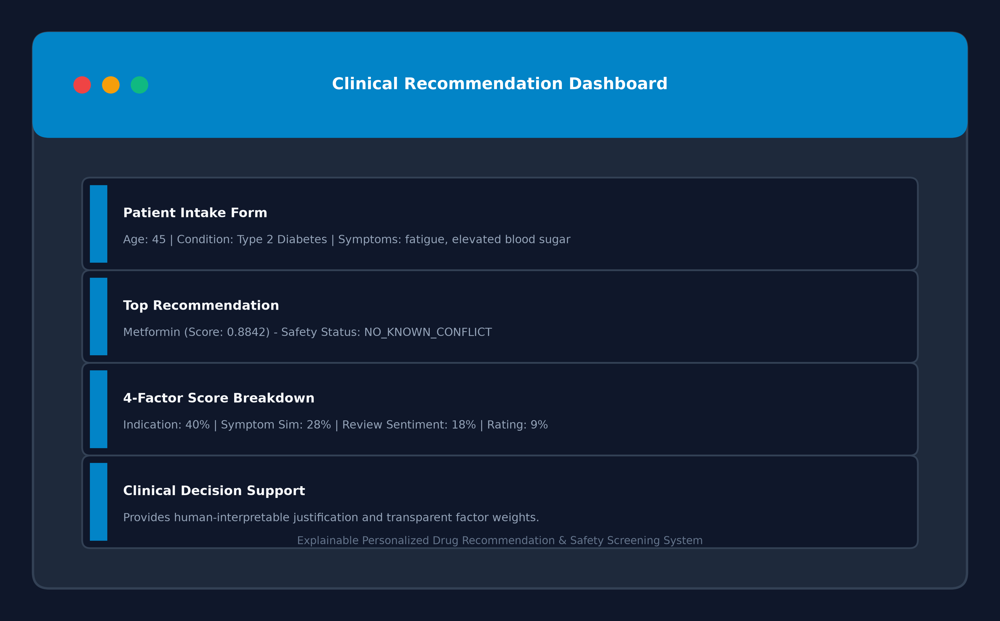
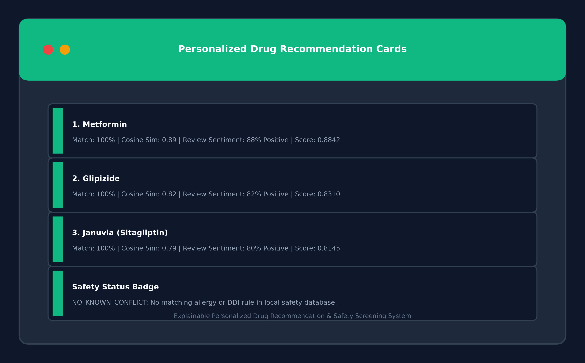
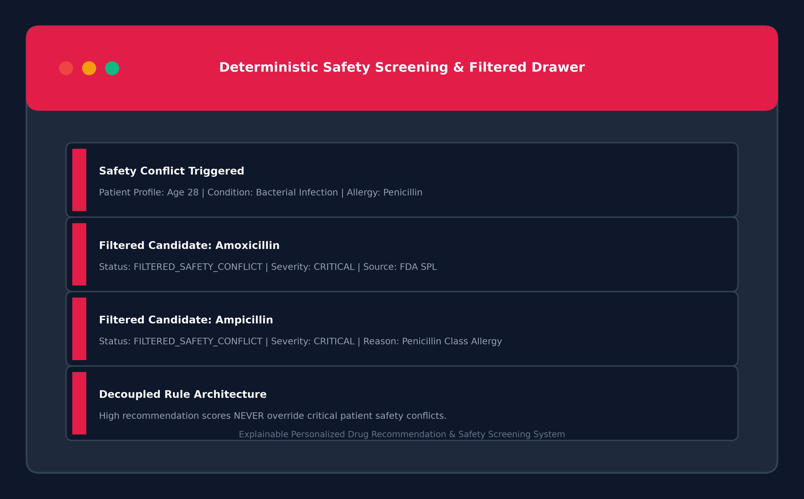
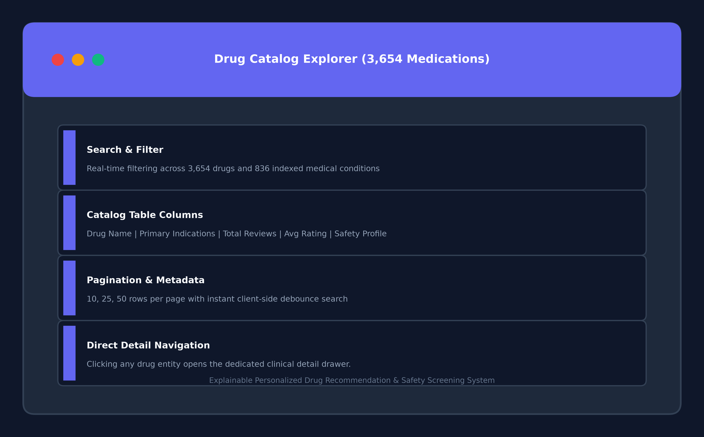
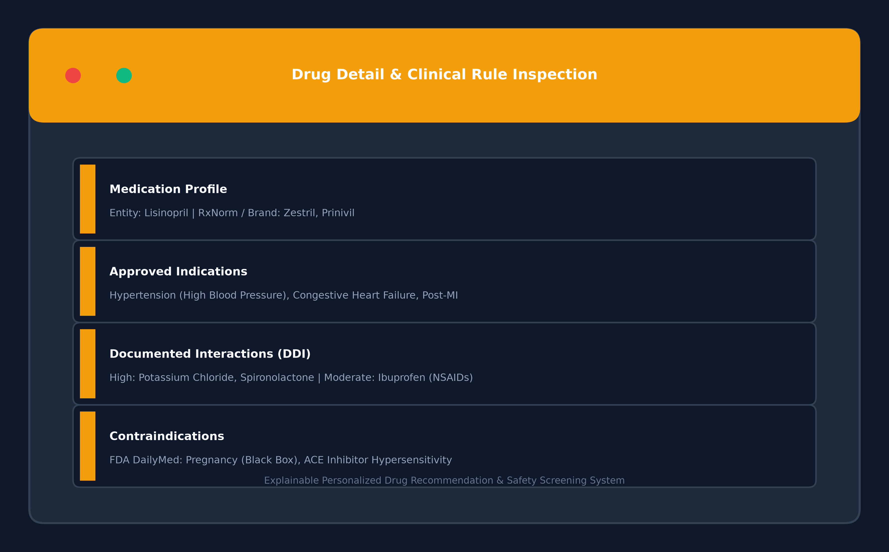
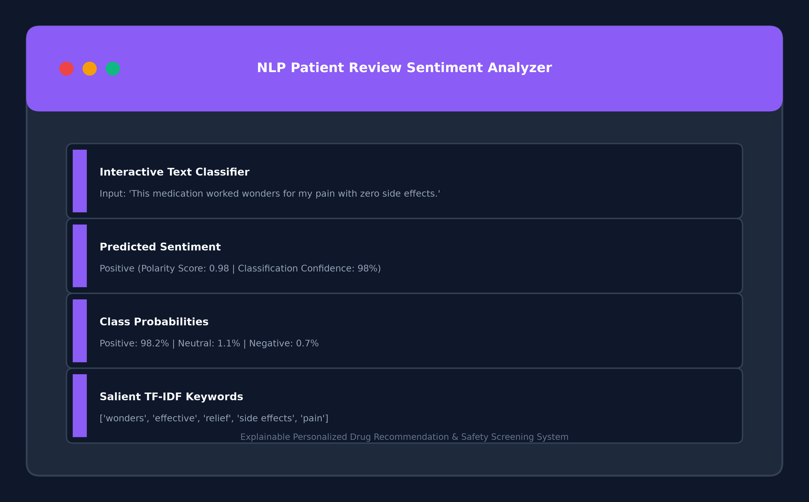
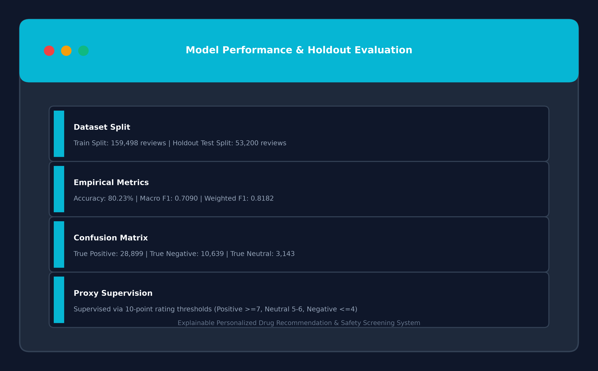
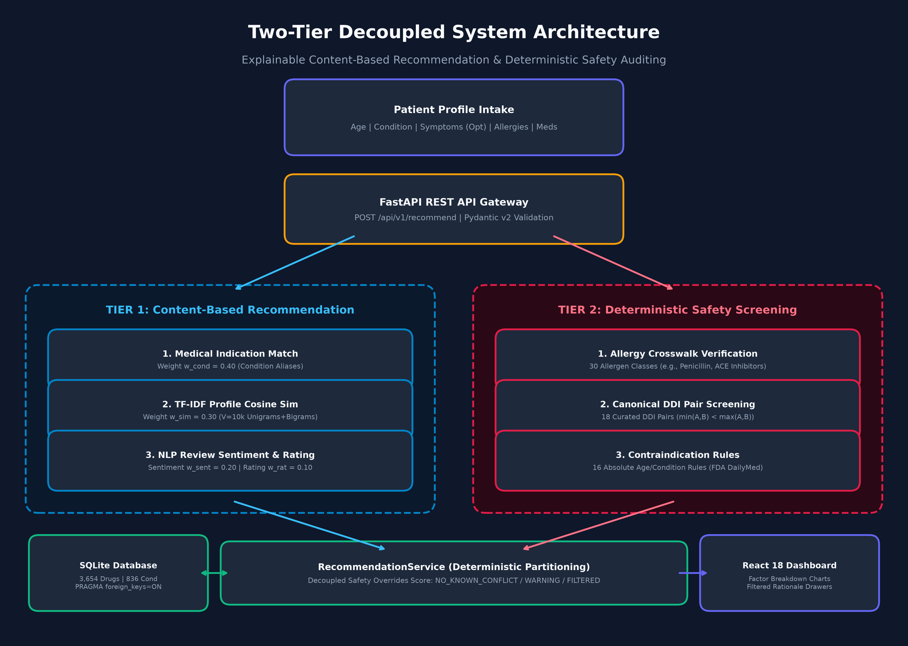
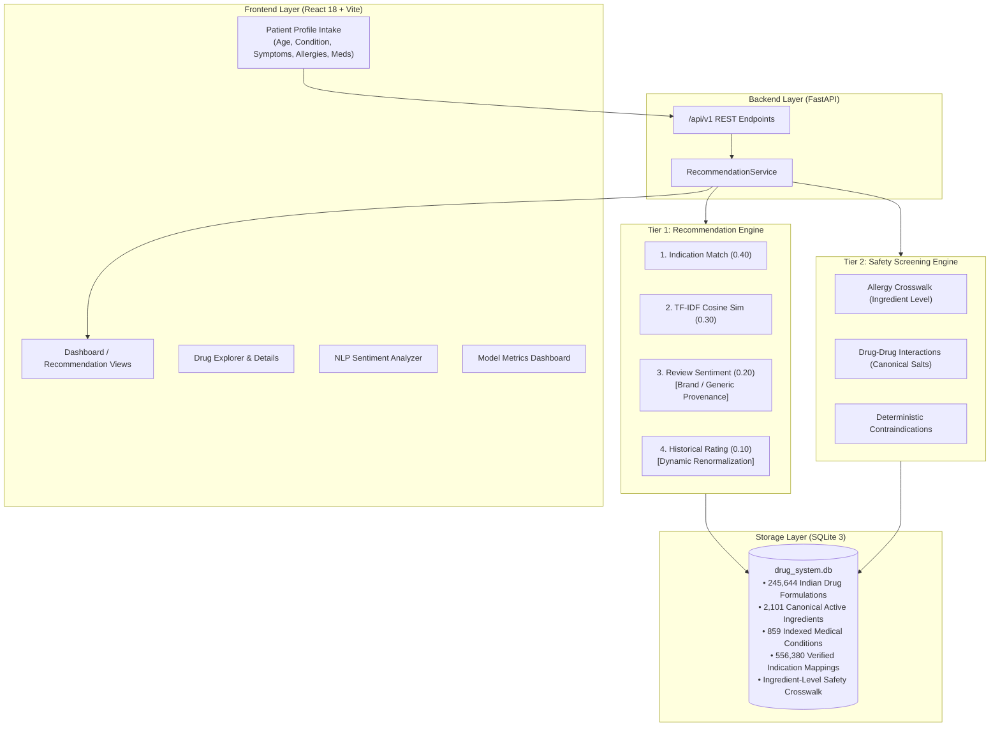
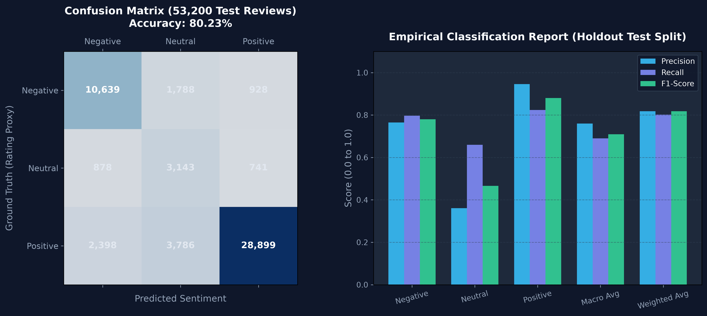

# Explainable Personalized Drug Recommendation and Safety Screening System

[](https://www.python.org)
[](https://fastapi.tiangolo.com)
[](https://react.dev)
[](https://tailwindcss.com)
[](https://scikit-learn.org)
[](https://www.sqlite.org)
[]()
[](LICENSE)

> **An academic clinical decision-support prototype combining machine-learning-based recommendation with deterministic safety screening across the Indian pharmaceutical catalog.**  
> *Final-Year Capstone Engineering Project*  
> **Author:** [Ashish Pal](https://github.com/Ashishpal110)

---

## ⚠️ Mandatory Educational & Research Disclaimer

> [!IMPORTANT]
> **This system is an academic research and clinical decision-support prototype. It does NOT provide medical advice, diagnosis, or prescriptions.**  
> The safety status `NO_KNOWN_CONFLICT` indicates only that **no matching allergy, drug-drug interaction (DDI), or contraindication rule was found in the local database**. It does **NOT** establish or prove clinical safety. All recommendations must be reviewed by a qualified healthcare professional.
> **Data Provenance Notice:** Indian pharmaceutical catalog listings, clinical indication mappings (NFI 2021, CDSCO, clinical monographs), and patient review-derived sentiment evidence originate from distinct sources and are explicitly labeled by provenance.

---

## 1. Project Overview

In healthcare informatics, standard machine learning recommendation models often operate as "black boxes," ranking items based purely on review text sentiment or keyword similarity. In clinical pharmacotherapy, prioritizing a drug based on positive satisfaction is perilous if patient-specific contraindications, drug allergies, or severe drug-drug interactions (DDIs) are ignored.

This project introduces a **decoupled two-tier architecture tailored for Indian pharmaceuticals**:
1. **Tier 1 (Content-Based Recommendation Pipeline)**: Evaluates candidate drugs based on medical indication match ($0.40$), TF-IDF symptom profile similarity ($0.30$), NLP model-inferred patient review satisfaction ($0.20$), and historical patient ratings ($0.10$). When rating or sentiment evidence is unavailable for an Indian brand, weights are dynamically renormalized without synthetic priors.
2. **Tier 2 (Deterministic Safety Screening Engine)**: An independent rule-based engine backed by relational SQLite tables (Allergy Crosswalk, Drug-Drug Interactions, and Age/Condition Contraindications) evaluated at the canonical active-ingredient level. High-severity conflicts immediately divert candidates to a filtered conflict view with transparent clinical rationales.

---

## 🖥️ Application Preview

### Clinical Dashboard
The primary intake dashboard allows inputting patient age, condition, reported symptoms, allergies, and active medications.


### Personalized Drug Recommendations
Approved candidates are displayed with multi-factor score meters, Indian pharmaceutical metadata (Brand, Composition, Manufacturer, INR pricing, Dosage Form, Pack Size), sentiment provenance callouts, and `NO_KNOWN_CONFLICT` safety badges.


### Deterministic Safety Screening & Conflict Filtering
Unsafe medications are automatically removed from the recommendation list and displayed with exact rule provenance, severity ratings, and clinical rationales.


### Medication Catalog & Drug Explorer
Search and inspect all 245,644 cataloged Indian formulations, active generic constituents, approved indications, and review metrics.


### Detailed Medication Entity Inspection
Comprehensive drawer detailing clinical indications, documented interactions, and deterministic contraindications.


### Real-Time NLP Review Sentiment Analyzer
Interactive classifier that evaluates raw patient review text, extracting polarity probability, confidence, and salient TF-IDF keywords.


### Model Performance & Evaluation Metrics
Live holdout test set performance dashboard showing confusion matrix and classification reports on 53,200 holdout reviews.


---

## 2. System Architecture

The architecture separates statistical ML scoring from deterministic safety verification:





---

## 3. Machine Learning Methodology & Results

### NLP Sentiment Model Configuration
- **Dataset**: Clinical Drug Review Corpus (159,498 training reviews, 53,200 holdout test reviews)
- **Feature Extraction**: `TfidfVectorizer(ngram_range=(1, 2), max_features=35000, sublinear_tf=True, stop_words="english")`
- **Classifier**: `LogisticRegression(C=1.0, solver="lbfgs", class_weight="balanced", max_iter=1000, random_state=42)`
- **Supervision**: Rating-derived proxy supervision ($\ge 7$ Positive, $5\text{--}6$ Neutral, $\le 4$ Negative)



### Empirical Holdout Evaluation (`models/sentiment_metrics.json`)

| Metric | Score | Description |
| :--- | :---: | :--- |
| **Accuracy** | **80.23%** (0.8023) | Overall classification accuracy on 53,200 holdout test reviews |
| **Macro Precision** | **0.7601** | Unweighted average precision across Positive, Neutral, Negative |
| **Macro Recall** | **0.6902** | Unweighted average recall across all 3 classes |
| **Macro F1-Score** | **0.7090** | Unweighted harmonic mean of precision and recall |
| **Weighted F1-Score** | **0.8182** | Support-weighted F1-Score reflecting class distribution |

---

## 4. Recommendation & Safety Rules

### Scoring Formula
$$\text{Score}_{\text{raw}} = \frac{w_{\text{cond}} \cdot \text{Match}_{\text{cond}} + w_{\text{sim}} \cdot \text{Sim}_{\text{content}} + w_{\text{sent}} \cdot \bar{S}_{\text{sentiment}} + w_{\text{rat}} \cdot R_{\text{rating}}}{\sum w_{\text{available}}}$$

- **Default weights**: $w_{\text{cond}}=0.40, w_{\text{sim}}=0.30, w_{\text{sent}}=0.20, w_{\text{rat}}=0.10$.
- **Dynamic Renormalization**: If rating or sentiment is missing for an Indian formulation, the missing factor weight is omitted and the remaining weights are renormalized.
- *Safety compatibility is strictly excluded from recommendation scoring factors.*

### Supported Safety Statuses
1. **`NO_KNOWN_CONFLICT`**: No matching rule found in local safety tables (never described as "SAFE").
2. **`WARNING`**: Moderate interaction detected; candidate retained in recommendations with caution banner.
3. **`FILTERED_SAFETY_CONFLICT`**: Severe allergy, high-severity DDI, or contraindication; candidate strictly moved to `filtered_drugs`.

---

## 5. API Specification

| Method | Endpoint | Description |
| :--- | :--- | :--- |
| `GET` | `/api/v1/health` | System health status, database connection, and model loading state |
| `POST` | `/api/v1/recommend` | Patient profile intake, recommendation scoring, and safety screening |
| `POST` | `/api/v1/sentiment/analyze` | On-demand NLP review sentiment inference and salient keyword extraction |
| `GET` | `/api/v1/conditions` | Catalog of 859 indexed medical conditions with mapped drug counts |
| `GET` | `/api/v1/allergies` | Supported allergen and pharmacological classes |
| `GET` | `/api/v1/drugs` | Paginated search of 245,644 cataloged Indian formulations |
| `GET` | `/api/v1/drugs/{drug_id}` | Detailed drug profile, indications, and seeded safety rules |
| `GET` | `/api/v1/model/metrics` | Live holdout test set evaluation metrics and pipeline specifications |

---

## 6. Installation & Quick Start

### 1. Clone the Repository
```bash
git clone https://github.com/Ashishpal110/explainable-drug-recommender.git
cd explainable-drug-recommender
```

### 2. Backend Setup (Terminal 1)
```bash
cd backend
python -m pip install -r requirements.txt
python -m uvicorn app.main:app --host 127.0.0.1 --port 8000 --reload
```
* **API Swagger Docs:** `http://127.0.0.1:8000/docs`
* **Health Check:** `http://127.0.0.1:8000/api/v1/health`

### 3. Frontend Setup (Terminal 2)
```bash
cd frontend
npm install
npm run dev
```
* **Interactive UI Dashboard:** `http://localhost:5173`

### 4. Running Verification Tests
```bash
python -m pytest backend/tests/ -v
```

---

## 7. Academic Capstone Documentation

- 📖 [Capstone Final Academic Report](docs/CAPSTONE_FINAL_REPORT.md)
- 🎯 [Interactive Demonstration Script](docs/DEMO_GUIDE.md)
- 🎓 [Viva Presentation & Slide Deck Guide](docs/VIVA_PRESENTATION_GUIDE.md)
- 📊 [Phase 9 Testing & Empirical Evaluation Report](docs/PHASE_9_TESTING_EVALUATION_REPORT.md)
- 📦 [Phase 10 Final Release Report](docs/PHASE_10_FINAL_RELEASE_REPORT.md)
- ✅ [Final Submission Checklist](docs/FINAL_SUBMISSION_CHECKLIST.md)
- 📐 [System Architecture Document](docs/SYSTEM_ARCHITECTURE.md)
- 🗄️ [Database Schema Design](docs/DATABASE_DESIGN.md)
- 🔌 [API Specification](docs/API_DESIGN.md)

---

## 8. License & Academic Credits

- **Author:** [Ashish Pal](https://github.com/Ashishpal110)
- **Degree:** Bachelor of Technology (B.Tech) in Artificial Intelligence and Machine Leaning. 
- **License:** [MIT License](LICENSE)
