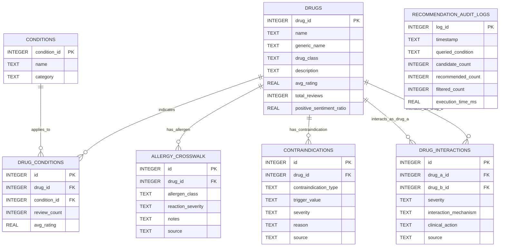

# Database Design: Explainable Personalized Drug Recommendation and Safety Screening System

## 1. Architectural Database Separation

The SQLite database is structured into two clearly demarcated functional layers:

1. **Layer 1: ML & Review-Derived Knowledge Store**
   - Contains processed information extracted from the Drugs.com review corpus: normalized drug catalog, condition mappings, aggregated review counts, average patient ratings, and sentiment polarity ratios.
2. **Layer 2: Deterministic Safety & Interaction Knowledge Base**
   - Contains structured, clinically sourced reference rules: allergen crosswalks, pairwise drug-drug interactions (DDIs), and flexible contraindication criteria with mandatory source traceability.

```
+-----------------------------------------------------------------------------------+
|                           SQLITE RELATIONAL DATABASE                              |
+-----------------------------------------------------------------------------------+
|  LAYER 1: ML & REVIEW-DERIVED KNOWLEDGE                                           |
|  - drugs                                                                          |
|  - conditions                                                                     |
|  - drug_conditions                                                                |
+-----------------------------------------------------------------------------------+
|  LAYER 2: DETERMINISTIC SAFETY RULES (Decoupled with Source Traceability)         |
|  - allergy_crosswalk                                                              |
|  - drug_interactions  (Unordered pair-wise constraint: drug_a_id < drug_b_id)      |
|  - contraindications  (Flexible type/trigger structure)                           |
+-----------------------------------------------------------------------------------+
|  LAYER 3: SESSION AUDIT & PERFORMANCE TELEMETRY (Optional V1)                     |
|  - recommendation_audit_logs                                                      |
+-----------------------------------------------------------------------------------+
```

> [!IMPORTANT]
> **Out-of-Scope Entities**:
> To preserve privacy and maintain a lightweight academic prototype, the database explicitly **omits**:
> - User accounts / Authentication credentials
> - Electronic Health Records (EHR) / Patient medical histories
> - Doctor / Prescriber entities
> - Long-term prescription logs
>
> All patient queries are evaluated in-memory per session.

---

## 2. Entity-Relationship (ER) Diagram



---

## 3. Schema Definitions & Table Specifications

---

### Layer 1: ML & Review-Derived Knowledge Store

#### Table 1: `drugs`
Stores normalized drug profiles, pharmacological classes, and aggregated patient review metrics.
```sql
CREATE TABLE drugs (
    drug_id INTEGER PRIMARY KEY AUTOINCREMENT,
    name TEXT NOT NULL UNIQUE,                  -- Normalized brand or primary name (e.g., 'Amlodipine')
    generic_name TEXT,                          -- Generic active substance (e.g., 'amlodipine besylate')
    drug_class TEXT NOT NULL,                   -- Pharmacological class (e.g., 'Calcium Channel Blocker')
    description TEXT,
    avg_rating REAL DEFAULT 0.0,                -- Mean rating from patient review corpus (1.0 to 10.0)
    total_reviews INTEGER DEFAULT 0,            -- Number of reviews present in dataset
    positive_sentiment_ratio REAL DEFAULT 0.0,  -- Ratio of positive sentiment proxy reviews (0.0 to 1.0)
    created_at TIMESTAMP DEFAULT CURRENT_TIMESTAMP
);

CREATE INDEX idx_drugs_name ON drugs(name);
CREATE INDEX idx_drugs_generic_name ON drugs(generic_name);
CREATE INDEX idx_drugs_drug_class ON drugs(drug_class);
```

#### Table 2: `conditions`
Stores distinct health conditions and clinical categories.
```sql
CREATE TABLE conditions (
    condition_id INTEGER PRIMARY KEY AUTOINCREMENT,
    name TEXT NOT NULL UNIQUE,                  -- Medical condition (e.g., 'Hypertension', 'Depression')
    category TEXT                               -- Broad category (e.g., 'Cardiovascular', 'Psychiatry')
);

CREATE INDEX idx_conditions_name ON conditions(name);
```

#### Table 3: `drug_conditions`
Associates drugs with indicated conditions, capturing condition-specific review frequency and satisfaction.
```sql
CREATE TABLE drug_conditions (
    id INTEGER PRIMARY KEY AUTOINCREMENT,
    drug_id INTEGER NOT NULL,
    condition_id INTEGER NOT NULL,
    review_count INTEGER DEFAULT 0,
    avg_rating REAL DEFAULT 0.0,
    FOREIGN KEY (drug_id) REFERENCES drugs(drug_id) ON DELETE CASCADE,
    FOREIGN KEY (condition_id) REFERENCES conditions(condition_id) ON DELETE CASCADE,
    UNIQUE(drug_id, condition_id)
);

CREATE INDEX idx_dc_drug_id ON drug_conditions(drug_id);
CREATE INDEX idx_dc_condition_id ON drug_conditions(condition_id);
```

---

### Layer 2: Deterministic Safety Knowledge Base

#### Table 4: `allergy_crosswalk`
Maps specific drugs to recognized allergen and chemical classes with explicit source attribution.
```sql
CREATE TABLE allergy_crosswalk (
    id INTEGER PRIMARY KEY AUTOINCREMENT,
    drug_id INTEGER NOT NULL,
    allergen_class TEXT NOT NULL,               -- e.g., 'Penicillins', 'Sulfa drugs', 'NSAIDs', 'ACE Inhibitors'
    reaction_severity TEXT DEFAULT 'HIGH',      -- 'HIGH', 'CRITICAL'
    notes TEXT,                                 -- Description of typical allergic reaction risk
    source TEXT NOT NULL,                       -- Source reference (e.g., 'FDA SPL / NLM DailyMed')
    FOREIGN KEY (drug_id) REFERENCES drugs(drug_id) ON DELETE CASCADE
);

CREATE INDEX idx_allergy_drug_id ON allergy_crosswalk(drug_id);
CREATE INDEX idx_allergy_class ON allergy_crosswalk(allergen_class);
```

#### Table 5: `drug_interactions`
Curated pairwise Drug-Drug Interaction (DDI) rules. 

> [!TIP]
> **Unordered Pair Constraint**:
> To guarantee that interactions between Drug A and Drug B cannot be duplicated as (A, B) and (B, A), the table enforces `CHECK (drug_a_id < drug_b_id)` alongside a composite `UNIQUE` constraint.

```sql
CREATE TABLE drug_interactions (
    id INTEGER PRIMARY KEY AUTOINCREMENT,
    drug_a_id INTEGER NOT NULL,
    drug_b_id INTEGER NOT NULL,
    severity TEXT NOT NULL,                     -- 'HIGH' (Fatal/Severe), 'MODERATE' (Caution)
    interaction_mechanism TEXT NOT NULL,        -- Clinical description of mechanism
    clinical_action TEXT NOT NULL,              -- Guideline (e.g., 'Avoid combination', 'Monitor potassium')
    source TEXT NOT NULL,                       -- Source reference (e.g., 'FDA Structured Product Labeling')
    FOREIGN KEY (drug_a_id) REFERENCES drugs(drug_id) ON DELETE CASCADE,
    FOREIGN KEY (drug_b_id) REFERENCES drugs(drug_id) ON DELETE CASCADE,
    CHECK (drug_a_id < drug_b_id),
    UNIQUE (drug_a_id, drug_b_id)
);

CREATE INDEX idx_ddi_drug_a ON drug_interactions(drug_a_id);
CREATE INDEX idx_ddi_drug_b ON drug_interactions(drug_b_id);
```

#### Table 6: `contraindications`
Flexible contraindication rule schema supporting diverse medical exclusion criteria (conditions, age groups, physiological states) without hard-coded schema assumptions.
```sql
CREATE TABLE contraindications (
    id INTEGER PRIMARY KEY AUTOINCREMENT,
    drug_id INTEGER NOT NULL,
    contraindication_type TEXT NOT NULL,        -- 'CONDITION', 'AGE', 'PREGNANCY', 'OTHER'
    trigger_value TEXT NOT NULL,                -- e.g., 'Asthma', '<18', 'Pregnancy Trimester 3'
    severity TEXT NOT NULL,                     -- 'ABSOLUTE', 'RELATIVE'
    reason TEXT NOT NULL,                       -- Underlying pathophysiological reason
    source TEXT NOT NULL,                       -- Source reference (e.g., 'RxNorm Prescribing Guidelines')
    FOREIGN KEY (drug_id) REFERENCES drugs(drug_id) ON DELETE CASCADE
);

CREATE INDEX idx_contra_drug_id ON contraindications(drug_id);
CREATE INDEX idx_contra_type ON contraindications(contraindication_type);
```

---

### Layer 3: Session Audit & Telemetry (Optional for V1)

#### Table 7: `recommendation_audit_logs` (Optional V1 Telemetry)
Stateless performance telemetry table used strictly for evaluating system latency and recommendation distributions during experiments.
```sql
CREATE TABLE IF NOT EXISTS recommendation_audit_logs (
    log_id INTEGER PRIMARY KEY AUTOINCREMENT,
    timestamp TIMESTAMP DEFAULT CURRENT_TIMESTAMP,
    queried_condition TEXT NOT NULL,
    candidate_count INTEGER NOT NULL,
    recommended_count INTEGER NOT NULL,
    filtered_count INTEGER NOT NULL,
    execution_time_ms REAL NOT NULL
);
```

---

## 4. Query & Screening Logic Examples

### A. Unordered DDI Lookup Query
```sql
-- Check if candidate drug (ID = :candidate_id) interacts with any active medication in (:med_id_1, :med_id_2)
SELECT 
    di.severity,
    di.interaction_mechanism,
    di.clinical_action,
    di.source,
    d_other.name AS interacting_drug_name
FROM drug_interactions di
JOIN drugs d_other ON (
    CASE 
        WHEN di.drug_a_id = :candidate_id THEN di.drug_b_id = d_other.drug_id
        ELSE di.drug_a_id = d_other.drug_id
    END
)
WHERE (di.drug_a_id = :candidate_id AND di.drug_b_id IN (:active_med_ids))
   OR (di.drug_b_id = :candidate_id AND di.drug_a_id IN (:active_med_ids));
```

### B. Allergy Class Conflict Query
```sql
-- Check if candidate drug (ID = :candidate_id) matches any recorded patient allergy class
SELECT 
    ac.allergen_class,
    ac.reaction_severity,
    ac.notes,
    ac.source
FROM allergy_crosswalk ac
WHERE ac.drug_id = :candidate_id 
  AND ac.allergen_class IN (:patient_allergy_classes);
```
