# Dataset Plan: Explainable Personalized Drug Recommendation and Safety Screening System

## 1. Executive Summary & Objective

The objective of this project is to build an explainable, research-grade decision-support prototype that identifies candidate drugs for a given medical condition/symptom query and performs independent, deterministic safety screening (allergy conflicts, drug-drug interactions, and basic contraindications).

To achieve this responsibly within an academic engineering scope, we use a publicly available drug review corpus alongside structured, verifiable biomedical safety reference tables.

---

## 2. Dataset Identification & Distinction

> [!IMPORTANT]
> **Clarification on Dataset Identity**:
> We explicitly distinguish between two commonly cited public drug datasets:
> 1. **Druglib.com Dataset (UCI)**: A smaller dataset containing approximately 4,143 records across ~10 attributes.
> 2. **Drugs.com Drug Review Corpus (Kaggle / UCI)**: The larger corpus containing `drugsComTrain_raw.tsv` (~161,297 records) and `drugsComTest_raw.tsv` (~53,766 records) collected by Félix Gräßer et al. (2018).
>
> **Selected Primary Corpus**: This project uses the **Drugs.com Drug Review Corpus** (`drugsComTrain_raw.tsv` and `drugsComTest_raw.tsv`, total ~215,063 records) as its primary dataset for condition-drug associations and patient review sentiment analysis.

### Primary Dataset Details: Drugs.com Drug Review Corpus
- **Source & Citation**: Félix Gräßer, Surya Kallumadi, Hagen Malberg, and Sebastian Zaunseder. *Aspect-Based Sentiment Analysis of Drug Reviews Applied to Healthcare Decision Support*, Proceedings of the 2018 International Conference on Digital Health (DH '18), 2018.
- **Data Acquisition**: Publicly distributed via UCI Machine Learning Repository / Kaggle for academic and research benchmarking.
- **License / Terms**: Distributed freely for educational and scientific research purposes as per original publication terms. Does not contain Protected Health Information (PHI) or personal patient identifiers.
- **Size**:
  - Training split (`drugsComTrain_raw.tsv`): 161,297 rows
  - Testing split (`drugsComTest_raw.tsv`): 53,766 rows
  - Coverage: ~3,500 distinct drugs across ~800 reported conditions.
- **Key Columns Utilized**:
  1. `uniqueID` (Integer): Unique row identifier.
  2. `drugName` (String): Commercial or generic drug name.
  3. `condition` (String): Patient-reported indication/condition (e.g., "Hypertension", "Depression", "Type 2 Diabetes").
  4. `review` (Text): Free-form, unstructured patient-reported review text.
  5. `rating` (Float/Integer): 10-point user satisfaction scale (1.0 to 10.0).
  6. `date` (Date): Review submission date.
  7. `usefulCount` (Integer): Number of users who upvoted the review.

---

## 3. Patient Review Interpretation & Sentiment Proxy Labels

### A. Non-Clinical Interpretation of Reviews
Online patient reviews represent **subjective, patient-reported experiences and perceived satisfaction**. 
- They **DO NOT** constitute randomized clinical trial (RCT) evidence, pharmacological proof, or clinical efficacy data.
- The system processes these texts strictly to assess **patient satisfaction patterns, condition-drug associations, and review sentiment polarity**, never to establish verified clinical efficacy.

### B. Rating-Derived Sentiment Proxy Labels
Because large-scale medical review corpora lack sentence-level manual clinician annotations, numerical ratings $r \in [1, 10]$ are used as **rating-derived proxy labels** for supervised sentiment classification:

$$\text{Sentiment Proxy Label} = \begin{cases} \text{Positive (1)}, & \text{if } r \ge 7 \\ \text{Neutral (0)}, & \text{if } 5 \le r \le 6 \\ \text{Negative (-1)}, & \text{if } r \le 4 \end{cases}$$

> [!NOTE]
> **Explicit Limitation**: Rating-derived labels serve solely as training supervision proxies. A high numerical rating or positive text sentiment indicates positive patient-reported feedback, not verified clinical superiority.

---

## 4. Structured Safety Reference Data

To ensure reliable, deterministic safety screening, safety checks are **not inferred by statistical NLP from unstructured reviews**. Instead, they are backed by structured biomedical reference data.

### Usable Public Sources (Lightweight Subset)
Rather than attempting to ingest the entire multi-gigabyte UMLS or complex RxNorm distribution, the project utilizes a lightweight, verifiable subset derived from:
1. **NLM RxNorm & DailyMed Open Data**: Standardized active ingredient names and major pharmacological classes (e.g., ACE Inhibitors, Beta Blockers, NSAIDs, Statins, Penicillins).
2. **FDA Structured Product Labeling (SPL) / Public Drug Interaction Data**: High-confidence pairwise drug-drug interactions (DDIs) with clear clinical severity levels (`HIGH / SEVERE`, `MODERATE`, `LOW`).
3. **Structured Allergy Crosswalk**: Explicit mapping between drug names/ingredients and recognized chemical allergen classes (e.g., Amoxicillin $\rightarrow$ Penicillins; Celecoxib $\rightarrow$ Sulfa drugs / NSAIDs).

> [!IMPORTANT]
> **No Assumed or Fabricated Record Counts**: The safety database will contain only the concrete, verified entries populated during data seeding for the active drug catalog (~200–400 commonly prescribed medications covering primary project conditions). Exact table counts will reflect actual seeded records, not speculative figures.

---

## 5. Preprocessing Pipeline

```mermaid
flowchart TD
    Raw["Raw TSV: drugsComTrain_raw.tsv / drugsComTest_raw.tsv"] --> Clean["Text Cleaning & Deduplication"]
    Clean --> Filter["Filter Missing Conditions & HTML Artefacts (e.g. &#039;)"]
    Filter --> Label["Generate Rating-Derived Proxy Sentiment Labels"]
    Label --> Split["Train/Test Data Splits for NLP Classifier"]
    Label --> Agg["Aggregate Drug-Level Stats (Avg Rating, Sentiment Ratio, Review Counts)"]
    
    SafetySource["Curated RxNorm/DailyMed Safety Data"] --> SafetyJSON["data/safety_rules.json"]
    SafetyJSON --> SafetyDB[("SQLite Safety Tables: Allergies, DDIs, Contraindications")]
    Agg --> DrugDB[("SQLite Drug & Condition Tables")]
```

### Preprocessing Steps:
1. **HTML Entity Decoding**: Unescape web artifacts (e.g., `&#039;` $\rightarrow$ `'`, `&amp;` $\rightarrow$ `&`, `&quot;` $\rightarrow$ `"`).
2. **Condition Normalization**: Strip erroneous HTML headers (e.g., `" users found..."`), lowercase/titlecase normalization.
3. **Text Normalization**: Regex-based punctuation handling, negation preservation (e.g., preserving "not effective", "no pain relief"), lowercasing.
4. **Feature Extraction**: Unigram + Bigram TF-IDF vectorization with sublinear term-frequency scaling.

---

## 6. Dataset Limitations

1. **Selection & Reporting Bias**: Patients who write online reviews often have either exceptionally positive or negative experiences.
2. **Proxy Supervision**: Rating-derived labels may occasionally misclassify nuanced reviews (e.g., high rating despite moderate side effects).
3. **Safety Coverage Boundary**: The local safety database covers curated high-risk interactions and standard allergy classes. **Absence of a conflict in the database does NOT mean a drug is clinically safe.**
