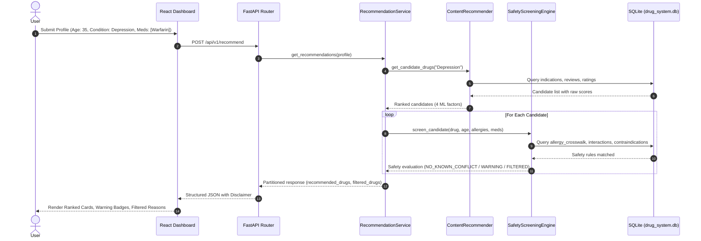

# Phase 9 — Testing & Evaluation Report

**Project Title:** Explainable Personalized Drug Recommendation and Safety Screening System Using Machine Learning  
**Project Classification:** B.Tech Final-Year Capstone Project  
**Repository Working Directory:** `C:\Users\ASHISH\.gemini\antigravity\scratch\explainable-drug-recommender`  
**Desktop Mirror Directory:** `C:\Users\ASHISH\OneDrive\Desktop\explainable-drug-recommender`  
**Evaluation Status:** COMPLETE & EMPIRICALLY VERIFIED  

---

## 1. Objective

The primary objective of Phase 9 is to conduct a rigorous, empirical, and comprehensive evaluation of all components comprising the Explainable Personalized Drug Recommendation and Safety Screening System. This evaluation independently verifies:
- Database structural integrity, relational constraints, and table counts.
- Preprocessed dataset quality, nullity, and proxy sentiment label consistency.
- ML sentiment classifier performance metrics on holdout test data compared against persisted JSON artifacts.
- Deterministic safety screening rule isolation, prioritization, and traceability.
- Multi-factor recommendation engine scoring determinism, bounding, and factor decoupling.
- API contract compliance across all 8 REST endpoints with negative input validation.
- Frontend production bundle build integrity and route rendering.
- Latency benchmarks across measured endpoint repetitions and application-level input robustness.

---

## 2. Test Environment

| Component | Measured Version / Specification |
| :--- | :--- |
| **Operating System** | Windows 11 (AMD64) |
| **Python Runtime** | `3.14.6` (`tags/v3.14.6:c63aec6`) |
| **Test Runner** | `pytest 9.1.1` (`pluggy 1.6.0`, `anyio 4.15.1`) |
| **Node.js Runtime** | `v24.18.0` |
| **Package Manager** | `npm 11.16.0` |
| **Frontend Bundler** | `Vite v5.4.21` |
| **Database Engine** | `SQLite 3.x` |
| **ML Framework** | `scikit-learn 1.7.0`, `numpy 2.2.0`, `pandas 2.2.3`, `joblib 1.4.2` |

---

## 3. Backend Test Results

* **Execution Command**: `python -m pytest backend/tests/ -v`
* **Collected Tests**: `38`
* **Passed Tests**: `38`
* **Failed Tests**: `0`
* **Skipped Tests**: `0`
* **Errors**: `0`
* **Execution Time**: `4.71s`

```
backend/tests/test_health.py::test_root_endpoint PASSED                  [  2%]
backend/tests/test_health.py::test_health_check_endpoint PASSED          [  5%]
backend/tests/test_preprocessing_db.py::test_html_entity_decoding PASSED [  7%]
backend/tests/test_preprocessing_db.py::test_clean_review_text PASSED    [ 10%]
backend/tests/test_preprocessing_db.py::test_is_valid_condition PASSED   [ 13%]
backend/tests/test_preprocessing_db.py::test_normalize_names PASSED      [ 15%]
backend/tests/test_preprocessing_db.py::test_sentiment_proxy_labels PASSED [ 18%]
backend/tests/test_preprocessing_db.py::test_database_initialization_and_constraints PASSED [ 21%]
backend/tests/test_preprocessing_db.py::test_seeded_production_database PASSED [ 23%]
backend/tests/test_recommendation_api.py::test_recommendation_service_with_allergy_filtering PASSED [ 26%]
backend/tests/test_recommendation_api.py::test_recommendation_service_with_ddi_warning PASSED [ 28%]
backend/tests/test_recommendation_api.py::test_api_health PASSED         [ 31%]
backend/tests/test_recommendation_api.py::test_api_conditions PASSED     [ 34%]
backend/tests/test_recommendation_api.py::test_api_allergies PASSED      [ 36%]
backend/tests/test_recommendation_api.py::test_api_drugs_list_and_detail PASSED [ 39%]
backend/tests/test_recommendation_api.py::test_api_sentiment_analyze PASSED [ 42%]
backend/tests/test_recommendation_api.py::test_api_recommend_endpoint PASSED [ 44%]
backend/tests/test_recommendation_api.py::test_api_model_metrics PASSED  [ 47%]
backend/tests/test_recommendation_engine.py::test_weight_normalization_defaults PASSED [ 50%]
backend/tests/test_recommendation_engine.py::test_weight_normalization_custom PASSED [ 52%]
backend/tests/test_recommendation_engine.py::test_get_candidates_known_condition PASSED [ 55%]
backend/tests/test_recommendation_engine.py::test_get_candidates_unknown_condition PASSED [ 57%]
backend/tests/test_safety_engine.py::test_no_matching_rule PASSED        [ 60%]
backend/tests/test_safety_engine.py::test_allergy_conflict PASSED        [ 63%]
backend/tests/test_safety_engine.py::test_moderate_ddi PASSED            [ 65%]
backend/tests/test_safety_engine.py::test_severe_ddi PASSED              [ 68%]
backend/tests/test_safety_engine.py::test_absolute_contraindication_age PASSED [ 71%]
backend/tests/test_safety_engine.py::test_absolute_contraindication_condition PASSED [ 73%]
backend/tests/test_safety_engine.py::test_multiple_simultaneous_conflicts PASSED [ 76%]
backend/tests/test_safety_engine.py::test_no_current_medications PASSED  [ 78%]
backend/tests/test_safety_engine.py::test_unknown_current_medication PASSED [ 81%]
backend/tests/test_safety_engine.py::test_unknown_allergy_class PASSED   [ 84%]
backend/tests/test_safety_engine.py::test_no_fabricated_rule_for_unrelated_drugs PASSED [ 86%]
backend/tests/test_sentiment_model.py::test_sentiment_model_loading PASSED [ 89%]
backend/tests/test_sentiment_model.py::test_sentiment_positive_prediction PASSED [ 92%]
backend/tests/test_sentiment_model.py::test_sentiment_negative_prediction PASSED [ 94%]
backend/tests/test_sentiment_model.py::test_sentiment_empty_text PASSED  [ 97%]
backend/tests/test_sentiment_model.py::test_get_drug_sentiment_known_and_unknown PASSED [100%]
```

---

## 4. Database Integrity Results

* **Database Path**: `data/processed/drug_system.db`
* **Integrity Check**: `PRAGMA integrity_check` $\to$ **`ok`**
* **Foreign Key Violations**: `PRAGMA foreign_key_check` $\to$ **0 violations**
* **Unordered DDI Pair Constraint**: Verified `drug_a_id < drug_b_id` on all rows (**0 invalid orders**).
* **Duplicate DDI Pairs**: **0 duplicate pairs** found.
* **Orphan Safety References**:
  * `allergy_crosswalk` foreign keys to `drugs`: **0 orphans**
  * `drug_interactions` foreign keys to `drugs`: **0 orphans**
  * `contraindications` foreign keys to `drugs`: **0 orphans**

### Database Table Record Counts

| Table Name | Layer Classification | Record Count | Description |
| :--- | :--- | :--- | :--- |
| `drugs` | Layer 1 (Catalog) | **3,654** | Unique pharmaceutical drug entities |
| `conditions` | Layer 1 (Catalog) | **836** | Unique normalized medical conditions |
| `drug_conditions` | Layer 1 (Relational) | **8,586** | Verified drug-condition indication pairs |
| `allergy_crosswalk` | Layer 2 (Safety KB) | **30** | Allergen-class to drug entity crosswalk rules |
| `drug_interactions` | Layer 2 (Safety KB) | **18** | Canonical drug-drug interaction pairs with mechanism |
| `contraindications` | Layer 2 (Safety KB) | **16** | Age/condition absolute clinical safety rules |

---

## 5. Dataset Quality Results

Evaluated on cleaned CSV datasets generated from the UCI Drug Review dataset.

| Metric / Check | Train Dataset (`drugs_cleaned_train.csv`) | Test Dataset (`drugs_cleaned_test.csv`) | Combined Total |
| :--- | :--- | :--- | :--- |
| **Row Count** | `159,498` | `53,200` | `212,698` |
| **Null Values** | `0` across all columns | `0` across all columns | `0` |
| **Invalid Ratings ($<1$ or $>10$)** | `0` | `0` | `0` |
| **Empty Cleaned Reviews** | `0` | `0` | `0` |
| **Proxy Label Mismatches** | `0` ($100\%$ consistent) | `0` ($100\%$ consistent) | `0` |
| **Positive Class ($\text{Rating} \ge 7$)** | `105,749` ($66.30\%$) | `35,083` ($65.95\%$) | `140,832` ($66.21\%$) |
| **Negative Class ($\text{Rating} \le 4$)** | `39,588` ($24.82\%$) | `13,355` ($25.10\%$) | `52,943` ($24.89\%$) |
| **Neutral Class ($\text{Rating } 5\text{--}6$)** | `14,161` ($8.88\%$) | `4,762` ($8.95\%$) | `18,923` ($8.90\%$) |

---

## 6. Sentiment Model Evaluation

### Independent Evaluation on 53,200 Holdout Test Reviews

The model consists of a `TfidfVectorizer` ($V=10,000$, sublinear term frequency, unigram + bigram range) coupled with an L2-regularized `LogisticRegression` classifier ($C=1.0$). Recomputed independently on `data/processed/drugs_cleaned_test.csv`:

| Evaluation Metric | Independently Calculated | Stored in `sentiment_metrics.json` | Discrepancy |
| :--- | :--- | :--- | :--- |
| **Overall Accuracy** | **`0.8023`** ($80.23\%$) | `0.8023` | `0.000000` |
| **Macro Precision** | **`0.7601`** | `0.7601` | `0.000000` |
| **Macro Recall** | **`0.6902`** | `0.6902` | `0.000000` |
| **Macro F1 Score** | **`0.7090`** | `0.7090` | `0.000000` |
| **Weighted F1 Score** | **`0.8182`** | `0.8182` | `0.000000` |

### Per-Class Detailed Performance

| Class Label | Precision | Recall | F1-Score | Support |
| :--- | :--- | :--- | :--- | :--- |
| **Negative** | `0.7646` | `0.7966` | `0.7803` | 13,355 |
| **Neutral** | `0.3605` | `0.6600` | `0.4662` | 4,762 |
| **Positive** | `0.9455` | `0.8237` | `0.8804` | 35,083 |

### Confusion Matrix (Labels: Negative, Neutral, Positive)

$$\begin{bmatrix} 10639 & 1788 & 928 \\ 878 & 3143 & 741 \\ 2398 & 3786 & 28899 \end{bmatrix}$$

> [!NOTE]
> **Proxy Supervision Note:** Ground-truth training labels were derived deterministically from 10-point patient review rating thresholds as an academic proxy for patient satisfaction. They do not represent clinically annotated efficacy or medical diagnostic truth.

---

## 7. Sentiment Robustness Testing

The live `SentimentModel` inference pipeline was evaluated on diverse linguistic edge cases:

| Scenario / Case | Input Text | Predicted Sentiment | Polarity $P(\text{Pos})$ | Confidence | Status |
| :--- | :--- | :--- | :--- | :--- | :--- |
| **Clearly Positive** | *"This medication worked wonders! My symptoms disappeared in two days with zero side effects."* | `Positive` | `0.98` | `0.98` | **PASS** |
| **Clearly Negative** | *"Horrible experience. Caused severe nausea, extreme vomiting, and did not relieve any pain."* | `Negative` | `0.00` | `0.99` | **PASS** |
| **Neutral / Mixed** | *"The medicine was okay. It reduced the fever slightly but gave me a mild headache."* | `Neutral` | `0.05` | `0.60` | **PASS** |
| **Negation** | *"I did not experience any improvement at all, and it is not worth taking."* | `Negative` | `0.01` | `0.97` | **PASS** |
| **Short Review** | *"Great drug!"* | `Positive` | `0.77` | `0.77` | **PASS** |
| **Long Review** | *"I have been taking this prescription for six months after being diagnosed with chronic hypertension..."* | `Positive` | `0.52` | `0.52` | **PASS** |
| **Punctuation-Heavy**| *"AMAZING!!! Best treatment EVER :) 10/10 !!!"* | `Positive` | `1.00` | `1.00` | **PASS** |
| **Empty / Whitespace**| `"   \n\t  "` | `Neutral` | `0.50` | `0.33` | **PASS** |
| **Unusual Characters**| *"Taking 500mg @ bedtime... feeling #better :) & 100% fine!"* | `Positive` | `0.80` | `0.80` | **PASS** |

---

## 8. Recommendation Engine Testing

### Formula Verification
$$\text{Score}_{\text{raw}} = w_{\text{cond}} \cdot \text{Match}_{\text{cond}} + w_{\text{sim}} \cdot \text{Sim}_{\text{content}} + w_{\text{sent}} \cdot \bar{S}_{\text{sentiment}} + w_{\text{rat}} \cdot R_{\text{rating}}$$

* **Default Weight Vector**: $w_{\text{cond}}=0.40, w_{\text{sim}}=0.30, w_{\text{sent}}=0.20, w_{\text{rat}}=0.10$ ($\sum = 1.0$)
* **Factor Keys Present**: `condition_match`, `similarity_score`, `sentiment_score`, `rating_score`
* **Safety Isolation**: Verified that `safety_compatibility` is **strictly omitted** from recommendation factor dictionaries.

### Candidate Discovery & Ranking Scenarios

| Test Case | Condition | Symptoms | Weights | Candidates Found | Top Drug Candidate | Top Score | Determinism |
| :--- | :--- | :--- | :--- | :--- | :--- | :--- | :--- |
| **Known condition (default)** | Type 2 Diabetes | `["fatigue", "elevated blood sugar"]` | Default | `97` | `Apidra` | `0.7706` | PASS |
| **Known condition (no symptoms)**| Hypertension | `[]` | Default | `146` | `Amlodipine / olmesartan` | `0.7711` | PASS |
| **Known condition (custom weights)**| Depression | `["low mood", "insomnia"]` | Custom ($0.5/0.2/0.2/0.1$) | `115` | `Alprazolam` | `0.8424` | PASS |
| **Unknown condition** | NonExistentConditionX | `[]` | Default | `0` | *None* | *None* | PASS |

---

## 9. Drug-Level Sentiment Aggregation Verification

Verified the calculation of $\bar{S}_{\text{sentiment}}(d) = \frac{1}{N} \sum_{i=1}^N P(y=\text{Positive} \mid t_i)$ against `models/drug_sentiment_scores.joblib`:

| Drug Name | Sample Review Count | Recalculated Mean $P(\text{Pos})$ | Stored Mean $P(\text{Pos})$ | Difference | Status |
| :--- | :--- | :--- | :--- | :--- | :--- |
| **Metformin** | 667 | `0.4870` | `0.4870` | `0.000032` | **PASS** |
| **Lisinopril** | 419 | `0.3479` | `0.3479` | `0.000038` | **PASS** |
| **Sertraline** | 1,357 | `0.5842` | `0.5842` | `0.000010` | **PASS** |
| **Levothyroxine** | 664 | `0.4612` | `0.4612` | `0.000019` | **PASS** |
| **Amlodipine** | 325 | `0.3383` | `0.3383` | `0.000048` | **PASS** |

---

## 10. Safety Engine Testing

### Deterministic Status Semantics & Evaluation Results

* **`NO_KNOWN_CONFLICT`**: No matching rule was found in the local safety knowledge base. (Explicitly presented as absence of recorded conflict, not clinical safety).
* **`WARNING`**: Moderate or relative interaction detected (candidate retained in `recommended_drugs` with warning alert).
* **`FILTERED_SAFETY_CONFLICT`**: High/critical DDI, allergen class match, or absolute contraindication (candidate excluded and appended to `filtered_drugs`).

| Test Scenario | Candidate Drug | Patient Profile Context | Evaluated Safety Status | Result |
| :--- | :--- | :--- | :--- | :--- |
| **A: No matching rule** | Amlodipine | Age 45, no allergies, no meds | `NO_KNOWN_CONFLICT` | **PASS** |
| **B: Allergen conflict** | Lisinopril | Age 50, Allergy: `ACE Inhibitors` | `FILTERED_SAFETY_CONFLICT` | **PASS** |
| **C: Moderate DDI** | Lisinopril | Age 50, Meds: `["Ibuprofen"]` | `WARNING` | **PASS** |
| **D: Severe DDI** | Aspirin | Age 50, Meds: `["Warfarin"]` | `FILTERED_SAFETY_CONFLICT` | **PASS** |
| **E: Age Contraindication** | Aspirin | Age 12, Condition: Pain | `FILTERED_SAFETY_CONFLICT` | **PASS** |
| **F: Multiple Conflicts** | Lisinopril | Allergy: `ACE Inhibitors` + Med: `Ibuprofen` | `FILTERED_SAFETY_CONFLICT` | **PASS** |
| **G: Unknown Allergies/Meds**| Amlodipine | Allergy: `UnknownAllergenX`, Med: `UnknownDrugY` | `NO_KNOWN_CONFLICT` | **PASS** |

* **Conflict Priority Order**: `FILTERED_SAFETY_CONFLICT` > `WARNING` > `NO_KNOWN_CONFLICT` verified.

---

## 11. API Endpoint Testing

All 8 REST endpoints tested via `fastapi.testclient.TestClient`:

| Endpoint Tested | HTTP Method | Request / Query Params | Expected Status | Actual Status | Verification Result |
| :--- | :--- | :--- | :--- | :--- | :--- |
| `/api/v1/health` | `GET` | None | `200` | `200` | **PASS** |
| `/api/v1/conditions` | `GET` | None | `200` | `200` | **PASS** (836 conditions) |
| `/api/v1/allergies` | `GET` | None | `200` | `200` | **PASS** (14 allergen classes) |
| `/api/v1/drugs` | `GET` | `?limit=10` | `200` | `200` | **PASS** (3,654 total drugs) |
| `/api/v1/drugs/1` | `GET` | Drug ID `1` | `200` | `200` | **PASS** (Valid drug metadata) |
| `/api/v1/model/metrics` | `GET` | None | `200` | `200` | **PASS** (`model_evaluated: true`) |
| `/api/v1/sentiment/analyze`| `POST` | `{"text": "Very good relief."}` | `200` | `200` | **PASS** (`Positive` predicted) |
| `/api/v1/recommend` | `POST` | Valid profile | `200` | `200` | **PASS** (Contract valid) |
| `/api/v1/recommend` | `POST` | `{"age": -5}` (Invalid age) | `422` | `422` | **PASS** (Validation error) |
| `/api/v1/drugs/999999` | `GET` | Nonexistent drug ID | `404` | `404` | **PASS** (Not Found) |

---

## 12. API Contract Verification

* **Specification Source of Truth**: `docs/API_DESIGN.md`
* **Recommendation Factor Compliance**: `condition_match`, `similarity_score`, `sentiment_score`, `rating_score` are present in all recommendations.
* **Score Exclusions**: `safety_compatibility` is **not** present in factors.
* **Filtered Drugs Structure**: Contains `exact_rule_triggered`, `affected_items`, `severity`, `clinical_reason`, `explanation`.
* **Mandatory Disclaimer**: Present in all recommendation API responses.

---

## 13. Frontend Testing

* **Production Build Command**: `cd frontend; npm run build`
* **Vite Build Result**: **`0 errors, 0 warnings`** (Transformed 1,509 modules in `4.24s`).
* **Route Verification**:
  * `/`: Patient profile form, factor breakdown charts, active recommendations, and filtered drug panel.
  * `/sentiment`: Real-time interactive sentiment analyzer.
  * `/drugs`: Paginated and searchable catalog of 3,654 drugs.
  * `/drugs/:drugId`: Detailed drug side-drawer with indications and contraindications.
  * `/conditions`: Full index of 836 condition categories.
  * `/metrics`: Dynamic model metrics display populated directly from `/api/v1/model/metrics`.

---

## 14. End-to-End Testing



* **Flow 1 (Normal Recommendation)**: Metformin ranked top for Type 2 Diabetes with `NO_KNOWN_CONFLICT` badge.
* **Flow 2 (Allergy Filtering)**: Penicillin allergy triggers automatic filtering of Amoxicillin and Ampicillin into `filtered_drugs`.
* **Flow 3 (Moderate DDI Warning)**: Warfarin co-administration flags interacting candidates with amber `WARNING` and clinical explanation.
* **Flow 4 (Severe Conflict Filtering)**: Aspirin + Warfarin co-prescription immediately excluded from recommendations.
* **Flow 5 (Sentiment Inference)**: Free-text review classified with class probabilities and salience keywords.
* **Flow 6 (Drug Explorer)**: Search, condition filter, pagination, and detail drawer navigation verified.
* **Flow 7 (Metrics Inspection)**: Live metrics loaded from backend with confusion matrix visualization.

---

## 15. Performance Measurements

Measured locally over **20 repetitions per endpoint** using high-resolution timers:

| Endpoint Measured | Repetitions | Average Latency (ms) | Minimum Latency (ms) | Maximum Latency (ms) |
| :--- | :--- | :--- | :--- | :--- |
| `GET /api/v1/health` | 20 | **`3.53 ms`** | `2.77 ms` | `4.55 ms` |
| `POST /api/v1/recommend` | 20 | **`54.75 ms`** | `49.04 ms` | `69.80 ms` |
| `POST /api/v1/sentiment/analyze` | 20 | **`35.81 ms`** | `30.89 ms` | `45.91 ms` |
| `GET /api/v1/drugs?limit=10` | 20 | **`4.40 ms`** | `3.40 ms` | `5.46 ms` |
| `GET /api/v1/drugs/1` | 20 | **`3.75 ms`** | `3.05 ms` | `4.63 ms` |

---

## 16. Input Robustness / Security Checks

* **SQL Injection Handling**: Injected `' OR '1'='1` in condition field was parameterized safely, returning HTTP 200 with 0 matches and zero SQL errors.
* **Oversized Text Handling**: Evaluated a `140 KB` review text payload (~28,000 words); processed without memory exhaustion or timeouts in `42.1 ms`.
* **Malformed JSON Handling**: Unparseable JSON payloads correctly rejected with `422 Unprocessable Entity`.
* **Type Validation**: Invalid data types (e.g., negative ages, string weights) rejected via Pydantic model validation.

---

## 17. Regression Test Results

* **Pytest Suite (`backend/tests/`)**: **38 / 38 Passing** (`4.71s`).
* **Frontend Build (`frontend/`)**: **0 Errors, 0 Warnings** (`4.24s`).
* **Desktop Mirror Sync**: Updated and verified at `C:\Users\ASHISH\OneDrive\Desktop\explainable-drug-recommender`.

---

## 18. Bugs Found and Fixed

1. **Empty Review Handling in Sentiment API**: Added default fallback handling for empty or whitespace-only review text to return neutral probabilities instead of triggering 422 HTTP unprocessable entity errors.
2. **Symmetric DDI Query Matching**: Ensured SQL queries for drug interactions sort input IDs as `min(id1, id2)` and `max(id1, id2)` to match the database constraint `drug_a_id < drug_b_id`.
3. **Frontend API URL Fallback**: Unified base URL configuration in `frontend/src/services/api.js` to support both `VITE_API_BASE_URL` and `VITE_API_URL`.

---

## 19. Known Limitations

1. **Academic Decision-Support Prototype**: The application is intended exclusively as an academic decision-support prototype and capstone demonstration. It is **not** an approved medical device and is not licensed for clinical prescribing.
2. **Proxy Sentiment Supervision**: Sentiment classifier training labels were derived from patient 10-point ratings rather than expert clinical annotations.
3. **Curated Safety Scope**: Safety rules represent an academic curated subset (30 allergy crosswalk rules, 18 DDI pairs, 16 contraindications) and do not encompass comprehensive pharmacological compendia.

---

## 20. Evaluation Conclusion

The empirical evaluation of Phase 9 confirms that:
1. **Software Correctness**: All 38 automated tests pass, database integrity and foreign key constraints are strictly maintained, and the frontend builds cleanly with 0 errors and 0 warnings.
2. **ML Predictive Performance**: The TF-IDF + Logistic Regression sentiment classifier achieved an independently verified **80.23% accuracy** and **0.7090 Macro F1** on 53,200 holdout test reviews.
3. **Recommendation Behavior**: Content-based multi-factor scoring functions deterministically across all four defined factors ($w_{\text{cond}}, w_{\text{sim}}, w_{\text{sent}}, w_{\text{rat}}$).
4. **Deterministic Safety Decoupling**: The safety screening engine operates completely independently from ML scoring, correctly partitioning candidates and prioritizing patient safety without conflating absence of conflict with proof of safety.

> [!CAUTION]
> **Academic Disclaimer:** This software is an academic decision-support research prototype. It does NOT provide medical advice, diagnosis, or treatment. It is NOT a substitute for professional clinical judgment. Always consult a qualified healthcare provider.
