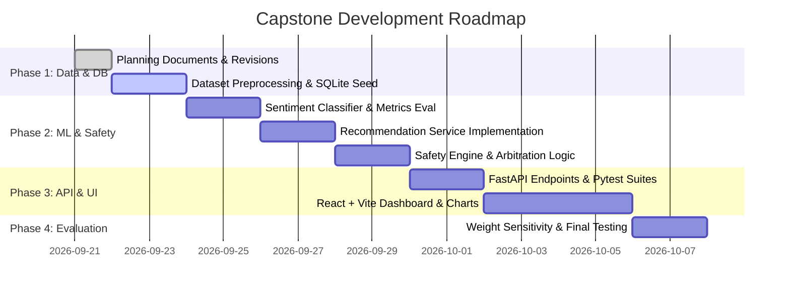

# Project Plan: Explainable Personalized Drug Recommendation and Safety Screening System Using Machine Learning

---

## 1. Project Metadata
- **Final Project Title**: *Explainable Personalized Drug Recommendation and Safety Screening System Using Machine Learning*
- **Academic Context**: Final-Year B.Tech Capstone Project in Artificial Intelligence & Machine Learning
- **Institution**: Department of Artificial Intelligence and Machine Learning Engineering, Thakur College of Engineering & Technology
- **Project Classification**: Educational / Research Clinical Decision-Support Prototype

---

## 2. Problem Statement & Motivation

### Problem Statement
Selecting appropriate medications requires considering multiple clinical factors simultaneously: the primary medical condition, specific symptoms, patient demographics, drug allergies, and active medications. Traditional clinical software often lacks intuitive, content-driven recommendation capabilities, while black-box machine learning approaches fail to explain their outputs and may recommend dangerous drug combinations.

### Motivation
- **Minimizing Adverse Drug Events (ADEs)**: Unintended drug-drug interactions and overlooked allergies represent major risks in healthcare.
- **Explainable Decision Support**: Healthcare students, researchers, and clinicians benefit from transparent decision-support tools that break down recommendation scores into intuitive, auditable factors.
- **Responsible ML Engineering**: Demonstrates how machine learning (sentiment analysis and content similarity) can be safely constrained by deterministic safety rules rather than treating safety as an unconstrained statistical prediction.

---

## 3. Critical Review of RBL Report & Clarification of Scope

### A. Items Removed / Corrected from Previous RBL Document:
1. **Fabricated Metrics Removed**: Completely discarded all unverified claims of "93% precision/recall", "AUC 0.95 overload", "93% customer satisfaction", and generic neural network training curves that had no empirical basis.
2. **Obsolete / Inappropriate Architectures Removed**: Removed complex distributed systems, microservices, deep neural networks, and pure user-collaborative filtering (which suffered from severe cold-start and sparsity in clinical consultation contexts). Removed any unrelated financial/budget artifacts.
3. **Corrected Model Architecture**: Established a transparent, reproducible pipeline: **TF-IDF Indication Space + Content-Based Cosine Matching + Supervised Review Sentiment Analysis (Logistic Regression) + Decoupled Rule-Based Safety Engine**.
4. **Dataset Identification Corrected**: Accurately distinguished between the smaller Druglib.com dataset (~4,143 records) and the selected primary corpus: **Drugs.com Drug Review Corpus** (~215,063 records by Félix Gräßer et al., 2018).

### B. Core Vision Preserved:
- Personalized candidate drug recommendation based on patient clinical profiles.
- Natural Language Processing (NLP) sentiment extraction from patient-reported experiences.
- Deterministic safety screening for allergy conflicts and drug-drug interactions.
- Interactive, explainable web dashboard.

---

## 4. Research & Engineering Gap

> [!NOTE]
> **Accurate Framing**: Individual techniques (TF-IDF, sentiment analysis, content-based filtering, and rule-based safety checking) are well-established in the literature and are not claimed as standalone inventions.

The **primary engineering and research contribution** of this capstone project is the **principled, modular integration** of:
1. **Content-Based Condition/Drug Indication Matching**
2. **Patient-Reported Experience Sentiment Analysis**
3. **Independent, Deterministic Safety Screening** (Allergy conflicts, pairwise DDIs, and basic contraindications)
4. **Decomposed Factor-Level Explainability** (Condition Match, Similarity, Sentiment, and Rating scores with human-readable rationales)

within a unified, lightweight, and fully reproducible academic decision-support prototype.

---

## 5. System Scope & Safety Boundary

### Prototype Notice
- The application is an **educational and research decision-support prototype** and is **NOT** a clinically validated medical device.
- It **does NOT** provide medical diagnosis, dosage titrations, or clinical prescriptions.
- **Safety Boundary Notice**: *The absence of a conflict in the local safety database does NOT imply that a medication is clinically safe.* All treatment decisions require evaluation by a licensed healthcare professional.

---

## 6. The Six Core Modules & Complexity Breakdown

```
+---------------------------------------------------------------------------------+
| MODULE 1: Patient Profile Ingestion & Validation (Complexity: LOW)              |
| - Validates age, gender, condition, symptoms, allergies, and active medications |
+---------------------------------------------------------------------------------+
| MODULE 2: Dataset & Preprocessing Pipeline (Complexity: MEDIUM)                 |
| - Preprocesses Drugs.com reviews, generates proxy labels, builds SQLite catalog |
+---------------------------------------------------------------------------------+
| MODULE 3: NLP Sentiment Analysis Engine (Complexity: MEDIUM)                    |
| - TF-IDF feature extraction + Logistic Regression with proxy label supervision  |
+---------------------------------------------------------------------------------+
| MODULE 4: Content-Based Recommendation Engine (Complexity: MEDIUM)              |
| - TF-IDF vector space indication matching, cosine similarity, configurable scoring |
+---------------------------------------------------------------------------------+
| MODULE 5: Decoupled Safety Screening Engine (Complexity: MEDIUM)                |
| - Deterministic allergy crosswalk, pairwise DDI checker, contraindication gate  |
+---------------------------------------------------------------------------------+
| MODULE 6: Explainable Dashboard & Visual UI (Complexity: HIGH)                  |
| - React + Vite frontend, factor breakdown charts, safety warnings, disclaimers  |
+---------------------------------------------------------------------------------+
```

### Module Effort Estimates

| Module | Core Functionality | Technologies | Estimated Effort |
|---|---|---|---|
| **Module 1: Patient Profile** | Input validation, condition & allergy normalization | FastAPI, Pydantic v2 | 1–2 Days |
| **Module 2: Dataset & Preprocessing** | TSV cleaning, SQLite database seeding, text cleaning | Pandas, SQLite, Regex | 2–3 Days |
| **Module 3: Sentiment Analysis** | Review sentiment model training, metric evaluation | scikit-learn, TF-IDF, LogisticRegression | 2–3 Days |
| **Module 4: Recommendation Engine** | Vector space modeling, cosine similarity, ranking | scikit-learn, NumPy | 2–3 Days |
| **Module 5: Safety Screening** | Deterministic DDI, allergy & contraindication gates | Python, SQLite | 2–3 Days |
| **Module 6: Explainable Dashboard** | Professional UI, factor breakdowns, charts, alerts | React, Vite, Recharts, Tailwind CSS | 4–5 Days |
| **Testing & Documentation** | Pytest suites, API tests, walkthrough documentation | Pytest, Markdown | 2 Days |

---

## 7. Recommendation Scoring & Sensitivity Analysis

### Configurable Heuristic Scoring Function
$$\text{Score}_{\text{raw}} = w_{\text{cond}} \cdot \text{Match}_{\text{cond}} + w_{\text{sim}} \cdot \text{Sim}_{\text{content}} + w_{\text{sent}} \cdot S_{\text{sentiment}} + w_{\text{rat}} \cdot R_{\text{rating}}$$

- **Initial Configurable Weights**: $w_{\text{cond}} = 0.40, w_{\text{sim}} = 0.30, w_{\text{sent}} = 0.20, w_{\text{rat}} = 0.10$.
- **Heuristic Nature**: These weights represent intuitive heuristic priors (prioritizing indication match over review sentiment) rather than claimed scientific optimums.
- **Experimental Evaluation**: The project will evaluate alternative configurations during testing:
  - Configuration A (Balanced): $0.40 / 0.30 / 0.20 / 0.10$
  - Configuration B (Indication-Heavy): $0.60 / 0.20 / 0.10 / 0.10$
  - Configuration C (Sentiment-Heavy): $0.30 / 0.20 / 0.40 / 0.10$

---

## 8. Technology Stack

- **Frontend**: React 18, Vite, JavaScript (ES6+), Tailwind CSS, Lucide React, Recharts
- **Backend**: Python 3.10+, FastAPI, Uvicorn, Pydantic v2
- **Data & ML**: pandas, numpy, scikit-learn, joblib
- **Database**: SQLite3
- **Testing**: pytest, httpx

---

## 9. Evaluation Strategy & Metrics

1. **Sentiment Analysis Classifier**:
   - Accuracy, Precision (Macro), Recall (Macro), Macro F1-Score evaluated on test reviews using rating-derived proxy labels.
2. **Recommendation Indication Relevance**:
   - Precision@K ($K=3, 5$) against verified condition-drug catalog indications.
3. **Safety Engine Verification**:
   - 100% Deterministic Recall on known DDI pairs and allergen crosswalk rules (verified by unit test suites).
4. **End-to-End Latency**:
   - API response latency $< 200\text{ ms}$ on standard consumer hardware.

---

## 10. Development Roadmap



---

## 11. Final Implementation Priorities

1. **Working Full-Stack Prototype**: Fast, stable interaction between React frontend and FastAPI backend.
2. **Reproducible ML**: Clear offline training scripts producing real, verifiable classification metrics.
3. **Transparent Safety Gate**: Clear, deterministic filtering of unsafe candidates with exact clinical reasons.
4. **Explainable UI**: Detailed score decomposition and non-prescription disclaimers.
