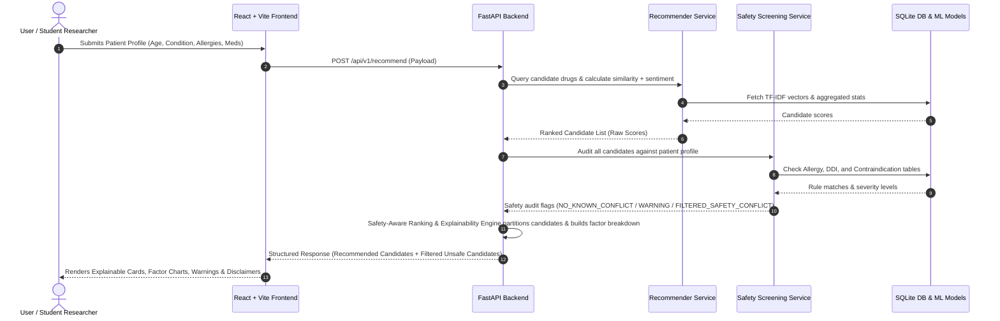

# System Architecture: Explainable Personalized Drug Recommendation and Safety Screening System

## 1. Project Overview

The **Explainable Personalized Drug Recommendation and Safety Screening System** is an educational and research-grade clinical decision-support prototype. It demonstrates how natural language processing (NLP), content-based recommendation techniques, and deterministic safety rules can be integrated to analyze patient-reported drug experiences alongside safety constraints.

> [!IMPORTANT]
> **Educational & Research Notice**:
> This system is an academic engineering prototype and **does NOT** provide medical diagnosis, clinical prescriptions, or treatment advice. 
> Crucially, **the absence of a safety conflict in the local database (status `NO_KNOWN_CONFLICT`) does NOT imply that a drug is clinically safe or suitable for a patient.** All treatment decisions must be made by qualified healthcare professionals.

---

## 2. Core Architectural Principle: Decoupled Recommendation & Safety

Statistical machine learning models estimate condition-drug relevance and patient-reported satisfaction. However, safety verification (such as allergy cross-reactivity and adverse drug interactions) must be **strictly decoupled** and governed by deterministic rules.

```
+-----------------------------------------------------------------------------------+
|                                 PATIENT PROFILE                                   |
|       (Age, Primary Medical Condition, Optional Symptoms, Allergies, Meds)        |
+------------------------------------------+----------------------------------------+
                                           |
                                           v
+-----------------------------------------------------------------------------------+
|                        MODULE 1: PATIENT PROFILE INGESTION                        |
+------------------------------------------+----------------------------------------+
                                           |
                    +----------------------+----------------------+
                    |                                             |
                    v                                             v
+---------------------------------------+     +-------------------------------------+
|   MODULE 4: RECOMMENDATION PIPELINE   |     |      MODULE 5: SAFETY SCREENING     |
|   - Condition Indication Matching     |     |   A. Patient Allergy Conflict       |
|   - TF-IDF Indication/Symptom Cosine  |     |   B. Pairwise Drug-Drug Interaction |
|   - Drug-Level Sentiment Score (M3)   |     |   C. Basic Contraindications        |
+-------------------+-------------------+     +------------------+------------------+
                    |                                            |
                    | Candidate Raw Scores                       | Safety Audit Result
                    | (0.0 to 1.0)                               | (NO_KNOWN_CONFLICT / WARNING /
                    |                                            |  FILTERED_SAFETY_CONFLICT)
                    +----------------------+---------------------+
                                           |
                                           v
+-----------------------------------------------------------------------------------+
|                 SAFETY-AWARE RANKING & EXPLAINABILITY ENGINE                      |
|  - Combines recommendation scores with independent safety results for final       |
|    ranking, presentation, and transparent explanation (Rule-based post-processor;  |
|    NOT an additional ML decision-maker).                                          |
|  - If Fatal/High Safety Conflict: Mark candidate as FILTERED_SAFETY_CONFLICT      |
|  - If Moderate Warning: Mark candidate as WARNING (Recommended with Caution)      |
|  - If Clear in Local DB: Mark candidate as NO_KNOWN_CONFLICT                     |
|  - Decompose scores: Condition Match, Similarity, Sentiment, Rating-Derived Score |
|  - Generate transparent human-readable explanations                               |
+------------------------------------------+----------------------------------------+
                                           |
                                           v
+-----------------------------------------------------------------------------------+
|                    MODULE 6: EXPLAINABLE FRONTEND DASHBOARD                       |
|           (React + Vite + Recharts + Factor Cards + Warning Badges)               |
+-----------------------------------------------------------------------------------+
```

---

## 3. The Six Core Modules

### Module 1: Patient Profile
- **Inputs**:
  - `age`: Integer ($\ge 0$)
  - `condition`: String (Primary medical condition/diagnosis)
  - `symptoms`: List of strings (Optional descriptive symptoms)
  - `allergies`: List of allergen / pharmacological classes (e.g., `["ACE Inhibitors"]`)
  - `current_medications`: List of active medications currently taken (e.g., `["Potassium Chloride"]`)
- **Validation**: Strict schema typing via Pydantic v2.

### Module 2: Dataset & Preprocessing
- **Source**: Drugs.com Drug Review Corpus (`drugsComTrain_raw.tsv`, `drugsComTest_raw.tsv`).
- **Processing**: HTML decoding, punctuation normalization, negation handling, rating-derived proxy sentiment label extraction, and SQLite catalog generation.

### Module 3: Review Sentiment Analysis
- **Supervised Classifier**: Unigram + Bigram TF-IDF vectorizer + Logistic Regression (or LinearSVC with Platt scaling / calibrated probabilities).
- **Individual Review Inference**: For an individual review text $t$, $S_{\text{sentiment}}(t) = P(y = \text{Positive} \mid t)$, the predicted probability of the positive rating-derived sentiment class.
- **Drug-Level Sentiment Aggregation**: For a given candidate drug $d$ with associated review set $R(d) = \{t_1, t_2, \dots, t_N\}$, the drug-level sentiment score is computed as the arithmetic mean of the review-level positive probabilities:
  $$\bar{S}_{\text{sentiment}}(d) = \frac{1}{N} \sum_{i=1}^{N} P(y = \text{Positive} \mid t_i)$$
- **Metrics**: Standard accuracy, precision, recall, and macro F1-score evaluated on holdout test reviews against rating-derived proxy labels.

### Module 4: Recommendation Engine
- **Representation**: Content-based TF-IDF feature space linking condition keywords, drug profiles, and patient-reported review aspects.
- **Similarity**: Cosine similarity $\text{Sim}(\mathbf{q}, \mathbf{d})$ between patient query profile and candidate drugs.
- **Configurable Heuristic Scoring Function**:
  $$\text{Score}_{\text{raw}} = w_{\text{cond}} \cdot \text{Match}_{\text{cond}} + w_{\text{sim}} \cdot \text{Sim}_{\text{content}} + w_{\text{sent}} \cdot \bar{S}_{\text{sentiment}} + w_{\text{rat}} \cdot R_{\text{rating}}$$
  *Note: Initial default heuristic weights ($w_{\text{cond}}=0.40, w_{\text{sim}}=0.30, w_{\text{sent}}=0.20, w_{\text{rat}}=0.10$) are configurable parameters, not claimed scientific optimums. The system supports tuning and sensitivity evaluation across alternative weight configurations.*

### Module 5: Safety Screening Engine (Restricted & Deterministic Scope)
Screening is restricted to three deterministic rule sets:
1. **Allergy Conflict**: Checks if the candidate drug or chemical class matches recorded patient allergies.
2. **Drug-Drug Interaction (DDI)**: Checks pairwise combinations between the candidate drug and the patient's active `current_medications`.
3. **Basic Contraindications**: Checks recorded condition or age exclusions where structured data is available.

*Standard Safety Statuses*:
- `NO_KNOWN_CONFLICT`: No conflict was found in the local safety knowledge base. *(This indicates absence of a matched local rule and must NOT be interpreted as proof of clinical safety).*
- `WARNING`: Moderate interaction or non-fatal precaution detected in the local database.
- `FILTERED_SAFETY_CONFLICT`: Severe allergy, critical DDI, or absolute contraindication detected. **The candidate is unconditionally partitioned to the Filtered list regardless of its recommendation score.**

### Module 6: Explainable Dashboard
Displays:
- **Recommended Drugs List**: Ranked candidates with composite scores, factor breakdown bars, and explanation narratives.
- **Filtered Drugs List**: Clear display of high-scoring but unsafe candidates, explicitly stating the **exact rule triggered, affected medication/allergy, severity level, and clinical reason**.
- **Visual Analytics**: Interactive Recharts for sentiment distribution and factor comparisons.
- **Educational Disclaimer**: Persistent banner stating decision-support scope.

---

## 4. End-to-End Data Flow



---

## 5. System Technology Stack & Modularity

- **Backend**: Python 3.10+, FastAPI (Asynchronous REST API), Pydantic v2 (Strict Schema Validation).
- **Machine Learning & NLP**: scikit-learn (TF-IDF, Logistic Regression, Cosine Similarity), pandas, numpy, joblib.
- **Storage**: SQLite3 (Local, embedded relational store).
- **Frontend**: React 18, Vite, Tailwind CSS, Recharts, Lucide Icons.
- **Testing**: pytest, httpx.

> [!TIP]
> **No Unnecessary Infrastructure**: The architecture strictly omits microservices, Kubernetes, Docker orchestration, MLflow, BioBERT/heavy transformer fine-tuning, and cloud clusters to guarantee local reproducibility and clean academic evaluation.
